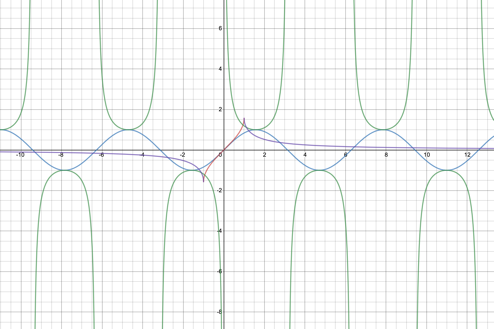
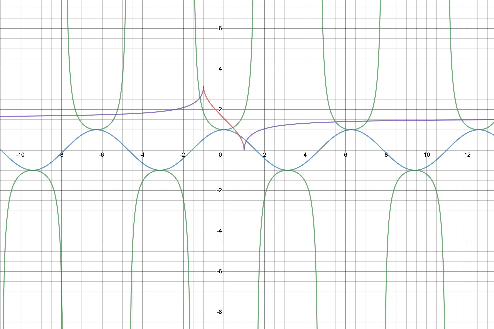
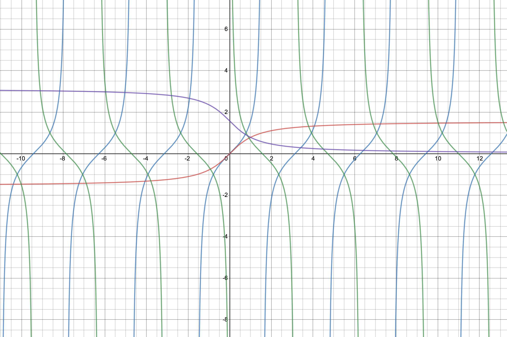
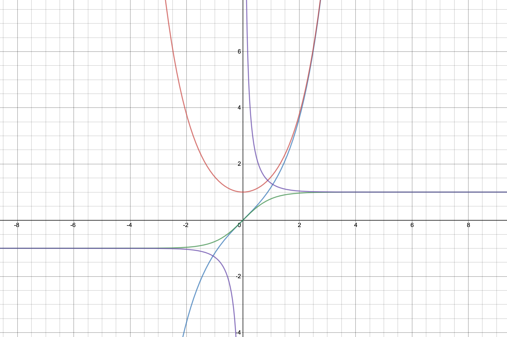

# 三角函数&反三角函数&双曲函数（Trigonometric function&Inverse trigonometric function&Hyperbolic function）

#### 1.定义

##### 1.1 (反)正弦函数、(反)余割函数
$$
\begin{align}
\textbf{正弦}&：y=sinx\,\,(x\in R，-1\leq y\leq 1)\\
\textbf{反正弦}&：y=arcsinx\,\,(-1\leq x\leq 1，-\frac{\pi}{2}\leq y\leq\frac{\pi}{2})\\
\textbf{余割}&：y=cscx=\frac{1}{sinx}\,\,(k\pi\leq x\leq(1+ k)\pi，k\in Z)\\
\textbf{反余割}&：y=arccscx\,\,
\end{align}
$$

**sinx**&emsp;**arcsinx**&emsp;**cscx**&emsp;**arccscx**

##### 1.2 (反)余弦函数、(反)正割函数
$$
\begin{align}
\textbf{余弦}&：y=cosx\,\,(x\in R，-1\leq y\leq 1)\\
\textbf{反余弦}&：y=arccosx\,\,(-1\leq x\leq 1，0\leq y\leq\pi)\\
\textbf{正割}&：y=secx=\frac{1}{cosx}\,\,(-\frac{\pi}{2}+k\pi\leq x\leq\frac{\pi}{2}+ k\pi，k\in Z)\\
\textbf{反正割}&：y=arcsecx\,\,
\end{align}
$$

**cosx**&emsp;**arccosx**&emsp;**secx**&emsp;**arcsecx**

##### 1.3正切函数、余切函数
$$
\begin{align}
\textbf{正切}&：y=tanx=\frac{sinx}{cosx}\,\,(-\frac{\pi}{2}+k\pi\leq x\leq\frac{\pi}{2}+ k\pi，k\in Z)\\
\textbf{反正切}&：y=arctanx\,\,(-\infty\leq x\leq +\infty， -\frac{\pi}{2}< y<\frac{\pi}{2})\\
\textbf{余切}&：y=cotx=\frac{1}{tanx}=\frac{cosx}{sinx}\,\,\,\,(k\pi\leq x\leq(1+ k)\pi，k\in Z)\\
\textbf{反余切}&：y=arcotx\,\,(-\infty\leq x\leq +\infty， 0< y < \pi)
\end{align}
$$

**tanx**&emsp;**arctanx**&emsp;**cotx**&emsp;**arccotx**

##### 1.3双曲函数

$$
e^{x}=sinhx + coshx=\frac{e^{x}-e^{-x}}{2}(奇部) + \frac{e^{x}+e^{-x}}{2}（偶部）
$$

$$
\begin{align}
\textbf{双曲正弦}&：y=shx=\frac{e^{x}-e^{-x}}{2}，（x，y\in R） \\
\textbf{双曲余弦}&：y=chx=\frac{e^{x}+e^{-x}}{2}，（x\in R，y\geq1）\\
\textbf{双曲正切}&：y=thx=\frac{shx}{chx}=\frac{e^{x}-e^{-x}}{e^{x}+e^{-x}}（x\in R，-1\leq y\leq 1）\\
\textbf{双曲余切}&：y=cthx=\frac{chx}{shx}=\frac{e^{x}+e^{-x}}{e^{x}-e^{-x}}（x\neq 0，|y|>1）
\end{align}
$$

**shx**&emsp;**chx**&emsp;**thx**&emsp;**cthx**

#### 2.常用公式

$$
\begin{align}
\\
&\textbf{和差角}\\
sin(a\pm b) &= sinacosb\pm cosasinb \\
cos(a\pm b) &= cosacosb\mp sinasinb \\
tan(a\pm b) &= \frac{tana \pm tanb}{1\mp tana\cdot tanb} \\
sh(a\pm b) &= shachb\pm chashb \\
ch(a\pm b) &= chachb\pm shashb \\
\\
&\textbf{和差化积}\\
sina + sinb &=2sin\frac{a+b}{2}cos\frac{a-b}{2}\\
sina - sinb &=2cos\frac{a+b}{2}sin\frac{a-b}{2}\\
cosa + cosb &=2cos\frac{a+b}{2}cos\frac{a-b}{2}\\
cosa - cosb &=-2sin\frac{a+b}{2}sin\frac{a-b}{2}\\
tana \pm tanb &=\frac{sin(a \pm b)}{cosa\cdot cosb}\\
cota \pm cotb &=\pm\frac{sin(a\pm b)}{sina\cdot sinb}\\
\\
&\textbf{积化和差}\\
sinacosb &=\frac{1}{2}[sin(a+b)+sin(a-b)]\\
cosasinb &=\frac{1}{2}[sin(a+b)-sin(a-b)]\\
cosacosb &=\frac{1}{2}[cos(a+b)-cos(a-b)]\\
sinasinb &=\frac{1}{2}[cos(a+b)-cos(a-b)]\\
\\
&\textbf{二倍角公式}\\
sin2a &=2sina\cdot cosa \\
cos2a &=2cos^{2}a - 1=1-2sin^{2}a=cos^{2}a - sin^{2}a\\
tan2a &=\frac{2tana}{1-tan^{2}a}
\\
\\
&\textbf{半角公式}\\
sin\frac{\alpha}{2}&=\pm\sqrt{\frac{1-cos\alpha}{2}}\\
cos\frac{\alpha}{2}&=\pm\sqrt{\frac{1+cos\alpha}{2}}\\
tan\frac{\alpha}{2}&=\frac{sin\alpha}{1+cos\alpha}=\frac{1-cos\alpha}{sin\alpha}=\pm\sqrt{\frac{1-cos\alpha}{1+cos\alpha}}
\end{align}
$$

