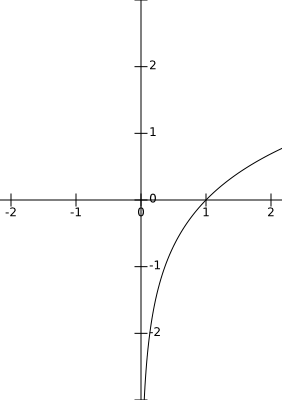
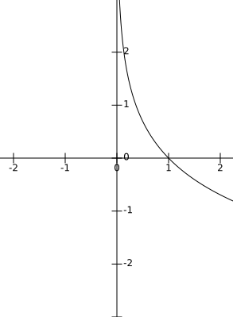

# 对数函数（Logarithmic function）

####  1.定义
$$
y={log_{a}}^{x}\,\,\,\,\,\,\,\,(a>0,a\neq 1)
$$

#### 2.反函数

对数函数的反函数是指数函数
$$
y={log_{a}}^{x} \Rightarrow x=a^{y}\Rightarrow y=a^{x}
$$

#### 3.几何图形

* ##### 1.a>1
$$
y={log_{a}}^{x}\,\,\,\,\,\,\,\,(a>1)\,\,\,\,\,\,\,\,例:y=ln^{x}
$$

* ##### 2. 0<a<1
$$
y={log_{a}}^{x}\,\,\,\,\,\,\,\,(0<a<1)\,\,\,\,\,\,\,\,例:y={log_{\frac{1}{e}}}^{x}
$$

