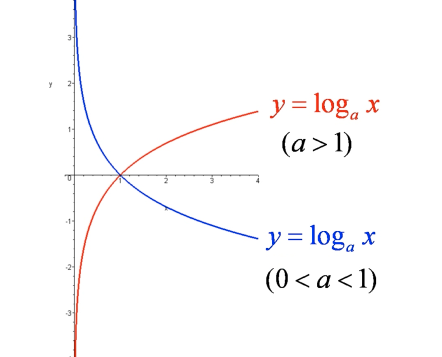

# 对数函数（Logarithmic function）

####  1.定义
$$
y={log_{a}}^{x}\,\,\,\,\,\,\,\,(a>0,a\neq 1)
$$

* 反函数

对数函数的反函数是指数函数
$$
y={log_{a}}^{x} \Rightarrow x=a^{y}\Rightarrow y=a^{x}
$$

* 几何图形

  **0<a<1**&emsp;**a>1**

#### 2.常用公式