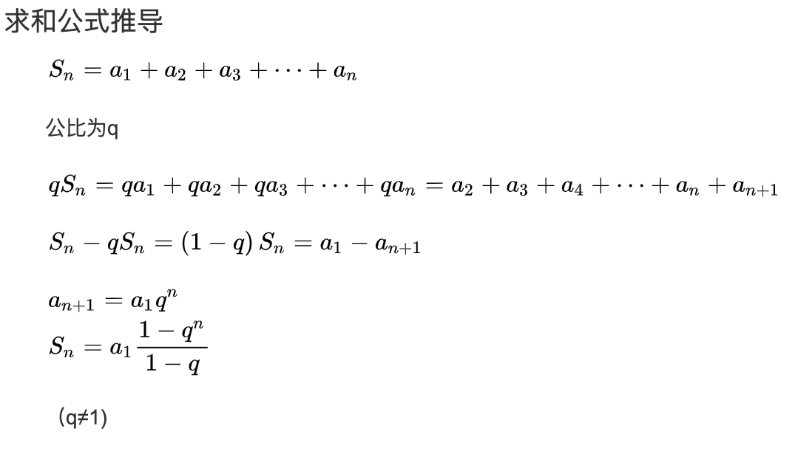
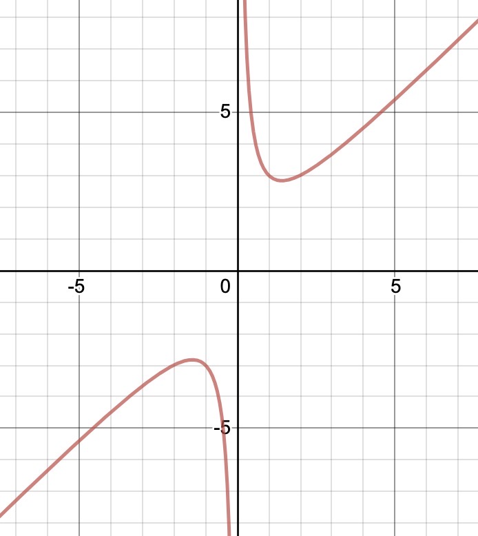

# 常用定理

##  一.均值不等式

### 1.定义

| 名称       | 公式                                                         |
| ---------- | ------------------------------------------------------------ |
| 调和平均数 | $\displaystyle H_{n} = \frac{n}{\sum_{i=1}^{n}\frac{1}{x_{i}}}=\frac{n}{\frac{1}{x_{1}}+\frac{1}{x_{2}}+...+\frac{1}{x_{n}}}$ |
| 几何平均数 | $\displaystyle G_{n}=\sqrt[n]{\prod_{i=1}^{n}x_{i}}=\sqrt[n]{x_{1}x_{2}...x_{n}}$ |
| 算数平均数 | $\displaystyle A_{n}=\frac{\sum_{i=1}^{n}x_{i}}{n}=\frac{x_{1}+x_{2}+...+x_{n}}{n}$ |
| 平方平均数 | $\displaystyle Q_{n} =\sqrt{\frac{\sum_{i=1}^{n}x_{i}^{2}}{n}}=\sqrt{\frac{x_{1}^{2}+x_{2}^{2}+...+x_{n}^{2}}{n}}$ |

则  $H_{n}\leq G_{n}\leq A_{n}\leq Q_{n}$ 称为均值不等式。
$$
\frac{n}{\frac{1}{x_{1}}+\frac{1}{x_{2}}+...+\frac{1}{x_{n}}}\leq \sqrt[n]{x_{1}x_{2}...x_{n}} \leq \frac{x_{1}+x_{2}+...+x_{n}}{n}\leq \sqrt{\frac{x_{1}^{2}+x_{2}^{2}+...+x_{n}^{2}}{n}}
$$

### 2.推广

|      | 前置条件                        | 公式                                                         |
| :--: | ------------------------------- | ------------------------------------------------------------ |
|  1   | 对实数 $a,b$                    | $a^{2} + b^{2} \geq 2ab$ （当且仅当 $a = b$ 时取 $=$） $a^{2} + b^{2} \geq -2ab$ （当且仅当 $a = -b$ 时取 $=$） |
|  2   | 对非负实数 $a,b$                | $a + b \geq 2\sqrt{ab}$                                      |
|  3   | 对非负实数 $a,b$                | $a + b \geq 2\sqrt{ab} \geq 0$                               |
|  4   | 对非负实数 $a,b$     $a \geq b$ | $a(a - b) \geq b(a - b)$                                     |
|  5   | 对非负实数 $a,b$                | $a^{2} + b^{2} \geq 2ab \geq 0$                              |
|  6   | 对实数 $a,b$                    | $\displaystyle a^{2} + b^{2} \geq \frac{(a + b)^{2}}{2} \geq 2ab$ |
|  7   | 对实数 $a,b,c$                  | $\displaystyle a^{2} + b^{2} + c^{2} \geq \frac{(a + b + c)^{2}}{3}$ |
|  8   | 对非负实数 $a,b$                | $\displaystyle a^{2} + b^{2} + ab \geq \frac{3}{4}(a+b)^{2}$ |
|  9   | 对非负实数 $a,b,c$              | $\displaystyle \frac{(a+b+c)}{3} \geq \sqrt[3]{abc}$         |

## 二.几何

### 1.点到直线的距离

设直线 $L$ 的方程为 $Ax+By+C=0$ ，点 P 的坐标为 $（x_{0},y_{0}）$ ，则点 $P$ 到直线 $L$ 的距离为：
$$
\frac{|Ax_{0} + By_{0} + C|}{\sqrt{A^{2}+B^{2}}}
$$

### 2.圆的方程

设圆心 $(a,b)$，半径为 $r$，则圆的方程式：$(x-a)^{2}+(y-b)^{2} = r^{2}$ 。

## 三.公式

$$
\begin{align}
2^{n-1}& \leq n!\,\,(n\geq2)\\\\
 a^{n}-b^{n}&=(a-b)(a^{n-1}+a^{n-2}b+...+ab^{n-2}+b^{n-1})\\\\
\end{align}
$$

|              | 内容                                                         |
| :----------: | :----------------------------------------------------------- |
|      |  |
| 圆锥体积公式 | $V=\frac{1}{3}Sh$，公式中 S 为圆锥底面面积，h 为圆锥的高。   |
|    绝对值    | $|\alpha(x)+\beta(x)| \leq|\alpha(x)|+|\beta(x)|\\|\alpha(x)\beta(x)|=|\alpha(x)||\beta(x)|\\|sinx| \leq |x|\\\\$ |
|   求和公式   | $\displaystyle 1+x+x^{2}+...+x^{n-1} =\frac{1-x^{n}}{1-x}$   |
|      值的比较   | $\displaystyle max\{f(x),g(x)\} =\frac{1}{2}[f(x)+g(x)+|f(x)-g(x)|] \\\\ \displaystyle min\{f(x),g(x)\} =\frac{1}{2}[f(x)+g(x)-|f(x)-g(x)|]\\\\$ |
| 等比数列求和 | ${a_{n}}$ 是一个等比数列：$a_{1}\,\,\, ,\,\,\, a_{2} = a_{1}q\,\,\, , \,\,\,a_{3} = a_{1}q^{2}\,\,\,...\,\,\, ,\,\,\, a_{n} = a_{1}q^{n-1}$ 则其前 $n$  项的和为  $ \displaystyle a_{1} + a_{2}+ ... + a_{n} = \frac{a_{1}(1-q^{n})}{1-q} = \frac{a_{1} - a_{n}q}{1-q}$。   |
|   对勾函数   | 函数 $\displaystyle y = ax + \frac{b}{x}$ （$a, b$  都大于 0 时）这类函数的图形一般是个对勾：  |
|              |                                                              |
|              |                                                              |
|              |                                                              |

## 四.定理&定义

| 名称                 | 内容                                                         |
| -------------------- | ------------------------------------------------------------ |
| 介值定理             | 如果定义域为 $[a，b]$ 的连续函数 $f$， 那么在区间内的某个点， 它可以在 $$和 $f(b)$ 之间取任何值， 也就是说，介值定理是在连续函数的一个区间内的函数值肯定介于最大值和最小值之间。 |
| 完全平方数           | 完全平方指用一个整数乘以自己，例如$1\cdot1,2\cdot2,3\cdot3$等，依此类推。若一个数能表示成某个整数的平方的形式，则称这个数为完全平方数。完全平方数是非负数，而一个完全平方数的项有两个。 |
| 最简分数（既约分数） | 最简分数，是分子、分母只有公因数1的分数，或者说分子和分母互质的分数，又称既约分数。如：$\displaystyle \frac{1}{2},\frac{2}{3},\frac{8}{9},\frac{3}{8}$ 等等。 |

