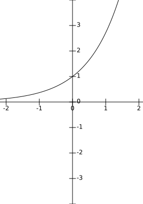
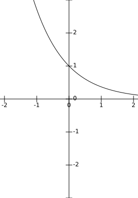

# 指数函数(Exponential function)

####  1.定义
$$
y=a^{x}\,\,\,\,\,\,\,\,(a>0,a\neq 1)
$$

#### 2.反函数

指数函数的反函数是对数函数
$$
y=a^{x} \Rightarrow x={log_{a}}^{y}\Rightarrow y={log_{a}}^{x}
$$

#### 3.几何图形

* ##### 1.a>1
$$
y=a^{x}\,\,\,\,\,\,\,\,(a>1)\,\,\,\,\,\,\,\,例:y=e^{x}
$$

* ##### 2. 0<a<1
$$
y=a^{x}\,\,\,\,\,\,\,\,(0<a<1)\,\,\,\,\,\,\,\,例:y=\frac{1}{e^{x}}
$$

