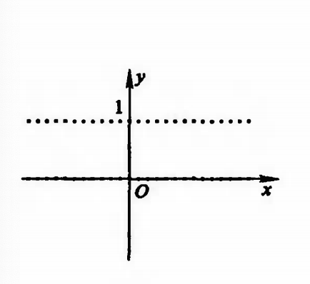
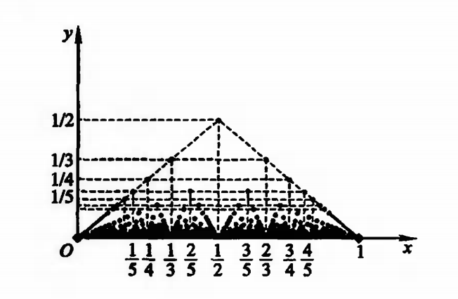
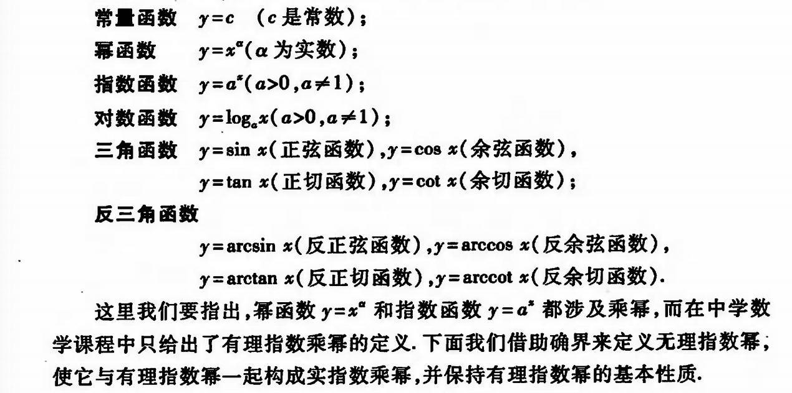

# 第一章 实数集与函数

## 一.实数

### 1.实数及其性质

#### 1.1 实数

**实数**：有理数和无理数统称为实数。

**有理数**：可用分数形式 $\displaystyle \frac{p}{q}$（$p$，$q$ 为整数， $q \neq 0$）表示，分数一定是有限十进小数或无限十进循环小数。

**无理数**：无限十进不循环小数。

任何一个有理数都可以用一个确定的无线小数来表示：

​          $x = a_{0} \cdot a_{1}a_{2}...(a_{n}-1)999....$

其中， 

$a_{0}$ 为非负整数，

$0 \leq a_{i} \leq 9$ （$i=1,2,3,...,n$），

$a_{n} \neq 0$ 。

例：$ 1 \rightarrow 0.999...$     $1.23 \rightarrow 1.22999..$

特殊规定： $0 \rightarrow 0.000...$

#### 1.2  相等、大于、小于

给定的两个非负实数

​		$x = a_{0}.a_{1}a_{2}...a_{n}...$       $y = b_{0}.b_{1}b_{2}...b_{n}..$

若有 $a_{k} = b_{k}$ （$k = 0,1,2,...,n,...$），则称 $x$ 和 $y$ 相等，记为 $x = y$。

若 $a_{0} > b_{0}$ 或存在非负整数 $l$ ，使得 $a_{k} = b_{k}\, ,\,\,\, k = 0,1,2,...,l$  而 $ a_{l+1} > b_{l+1}$ ，则称 $x$ 大于 $y$， 或 $y$ 小于 $x$ ，分别记作 $x > y$ 或 $y < x$ 。

对于负实数 $x$ 、 $y$ ，若按上述规定分别由 $-x = -y$ 与 $-x > -y$ ，则分别称 $x = y$ 与 $x < y$ （或 $y > x$）。另外，自然规定任何非负实数大于任何负实数。  

#### 1.3 过剩近似 $\overline{x_{n}}$ &不足近似 $x_{n}$

设**非负实数**  $x = a_{0}.a_{1}a_{2}...a_{n}...$ ；

称有理数 $x_{n} = a_{0}.a_{1}a_{2}...a_{n}$ 为实数 $x$ 的 $\color{blue}n$ 位不足近似 ；

而有理数 $\displaystyle \overline{x_{n}} = x_{n} + \frac{1}{10^{n}}$ ，称为 $x$ 的  $\color{red}n$ 位过剩近似。

而**负实数** $x = -a_{0}.a_{1}a_{2}...a_{n}...$ ，其 $n$ 位不足近似与过剩近似分别规定为 $\displaystyle x = -\overline{x_{n}} - \frac{1}{10^{n}}$ 和 $\overline{x_{n}} = -a_{0}.a_{1}a_{2}...a_{n}$ 。

>例：
>
> $x = 0.1234...n...$ 
>
>不足近似：$x_{3} = 0.123$     过剩近似：$\overline{x_{3}} = 0.124$ ；
>
>$x = -0.1234...n...$
>
>不足近似：$x_{3} = -0.124$     过剩近似：$\overline{x_{3}} = -0.123$ 。

#### 1.4 命题 $x > y$ 的等价条件

给定的两个实数

​		$x = a_{0}.a_{1}a_{2}...a_{n}...$       $y = b_{0}.b_{1}b_{2}...b_{n}..$

则 $\color{blue}x \color{blue}> \color{blue}y$ 的等价条件是：

存在非负整数 $n$ ，使得 $\color{blue}x_{\color{blue}n} \color{blue}> \overline{\color{blue}y_{\color{blue}n}}$ 。

**例1**. 设 $x,y$ 为实数，$x < y$ ，证明：存在有理数 $r$ 满足 $x < r < y$ 。

**证**：

由于 $x < y$ ，故存在非负整数 $n$ ，是的 $\overline{x_{n}} < y_{n}$ ，

令 $\displaystyle r = \frac{1}{2}(\overline{x_{n}} + y_{n})$ ，则 $r$ 为有理数，

且有 $x \leq \overline{x_{n}} < r < y_{n} \leq y$ ，

即得 $x < r < y$ 。

#### 1.5 实数的性质

|      | 实数的性质                                                   |
| ---- | :----------------------------------------------------------- |
| 1    | 实数集 $R$ 对加减乘除（除数不为 0）四则运算是**封闭**的，即任意两个实数的和差积商（除数不为 0）仍是实数。 有理数集 $Q$ 的四则运算也是封闭的，任意连两个有理数的和差积商仍是有理数。 但无理数的四则运算则不是封闭的。 |
| 2    | 实数集是**有序**的，即任意两实数 $a,b$ 比满足下述三个关系之一：$a < b$ ，$a = b$ ，$a > b$ 。 |
| 3    | 实数的大小关系是具有**传递性**，即若 $a > b$ ，$b > c$ ，则有 $a > c$ 。 |
| 4    | 实数具有**阿基米德性**（Archimedes），即对任何 $a,b \in R$ ，若 $b > a >0$ ，则存在正整数 $n$ ，是的 $na > b$ 。 |
| 5    | 实数集 $R$ 具有**稠密性**，即任何两个不相等的实数之间必有另一个实数，且既有有理数，也有无理数。 |
| 6    | 如果一直线上确定一点 $O$ 作为远点，指定一个方向为正向，并规定一个长度单位，则称此直线为**数轴**。 任意实数都对应数轴上唯一的一点；反之，数轴上每一点都唯一的代表一个实数。于是，**实数集 $R$ 与数轴上的点有着一一对应关系**。 |

**例2**. 设 $a,b \in R$ ，证明：若对任何正数 $\xi$ ，有 $a < b + \xi$ ，则 $a \leq b$ 。

**证**：（反证法）

假设对任何正数 $\xi$ ，有 $a < b + \xi$ ，则 $a > b$ 

令 $\xi = a - b$ ，

则 $\xi$ 为正数，且 $a = b + \xi$ ，与假设 $a < b + \xi$ 矛盾，

从而必有 $a \leq b$ 。

### 2.绝对值与不等式

#### 2.1 定义

实数 $a$ 的绝对值定义为

​		$ |a| = \left\{\begin{matrix} a, &a\geq 0 \\ -a, & a < 0 \end{matrix}\right.$

从数轴上看，数 $a$ 的绝对值 $|a|$ 就是点 $a$ 到原点的距离。

#### 2.2 性质

|      | 实数的绝对值的性质                                           |
| ---- | ------------------------------------------------------------ |
| 1    | $ |a| = |-a| \geq 0$ ，当且仅当 $a = 0$ 时有 $|a| = 0$ 。    |
| 2    | $-|a| \leq a \leq |a|$ 。                                    |
| 3    | $|a| < h \Leftrightarrow -h<a<h \\ |a| \leq h \Leftrightarrow -h \leq a \leq h$   （$h>0$） |
| 4    | 对于任何 $a,b \in R$ ，有如下三角形不等式： $|a| - |b| \leq |a \pm b| \leq |a| + |b|$ |
| 5    | $|ab| = |a||b|$                                              |
| 6    | $\displaystyle |\frac{a}{b}| = \frac{|a|}{|b|}$ （$b \neq 0$） |

## 二.数集·确定原理

### 1.区间与邻域

#### 1.1 区间

设 $a,b \in R$ ，且 $a < b$

**开区间** ：我们称数集 $\{x |a<x<b \}$ 为开区间，记作 $(a,b)$ 。

**闭区间** ：数集 $\{x|a\leq x \leq b \}$ 称为闭区间，记作 $[a,b]$ 。

**半开半闭区间** ：数集 $\{x|a\leq x <b\}$ 和 $\{x|a<x \leq b\}$ 都称为半开半闭区间，分别记作 $[a,b)$ 和 $(a,b]$ 。

以上这几类区间统称为有限区间。

**无限区间** ：满足关系式 $x \geq a$ 的全体实数 $x$ 的集合记作 $[a,+\infty)$ ，这里符号 $\infty$ 读作“无穷”，$+\infty$ 读作正无穷大，$-\infty$ 读作“负无穷大”。类似地，$[a,+\infty)$、$(-\infty,a)$ 、$(-\infty,+\infty)$ 以上这几类数集都称为无限区间。

有限区间和无限区间统称为区间。

**例1**. 证明数集 $x_{+} = \{n | n 为正整数\}$ 有下界而无上界。

**证** ：

1) 有下界 $\Rightarrow$ 显然，任何一个不大于 1 的实数都是 $N_{+}$ 的下界，故 $N_{+}$ 有下界的数集。

2) 有上界 $\Rightarrow$ 对任何正数 $M$ ，取 $n_{0} = M +1$ ，则 $n_{0} \in N_{+}$ ，且 $n_{0} > M$ ，所以 $N$ 无上界。

#### 1.2 领域

设 $a\in R, \delta > 0$ ，

满足绝对值不等式 $|x-a| < \delta$ 的全体实数 $x$ 的集合称为点 $a$ 的 $\delta$ **领域** ，记作 $U(a;\delta)$ ，或简单的写作 $U(a)$，既有

​				$U(a;\delta) = \{x|\,\,\,|x-a| < \delta \} = (a-\delta, a+\delta)$

点 $a$ **的空心领域**定义为

​				$U^{\circ}(a;\delta) = \{x| 0<|x-a|<\delta\}$

也可以简单地记作 $U^{\circ}(a)$。

> $U^{\circ}(a;\delta)$ 和 $U(a;\delta)$ 的差别在于：$U^{\circ}(a;\delta)$ 不包含点 $a$。

此外，我们还常用到以下几种领域：

**点 a 的 $\delta$ 右领域** $U_{+}(a;\delta)=[a,a+\delta)$ ，简记为 $U_{+}(a)$ ；

**点 a 的 $\delta$ 左领域** $U_{-}(a;\delta)=(a-\delta,a]$ ，简记为 $U_{-}(a)$ ；

**点 a 的空心 $\delta$ 右领域** $U_{+}^{\circ}(a;\delta) = (a, a+ \delta)$ ，简记为 $U_{+}^{\circ}(a)$ ；

**点 a 的空心 $\delta$ 左领域** $U_{-}^{\circ}(a;\delta) = (a - \delta, a)$ ，简记为 $U_{-}^{\circ}(a)$ 。

**$\infty$ 领域** $U(\infty) = \{x|\,\,\, |x|> M\}$ ，其中 $M$ 为充分大的正数（下同）；

**$+\infty$ 领域** $U(+\infty) = \{x|\,\,\, x> M\}$ ；

**$-\infty$ 领域** $U(-\infty) = \{ x| x< -M\}$ 。

### 2.有界集·确界原理

#### 2.1 上（下）界&有（无）界集

设 $S$ 为 $R$ 中的一个数集，若存在数 $M (L)$，使得对一切 $x \in S$ ，都有 $x \leq M \,\, (x \geq L)$，则称 $S$ 为**有上界（下界）的数集**，数 $M(L)$ 称为 $S$ 的一个**上界（下界）**。

若数集 $S$ 即有上界又有下界，则成 $S$ 为**有界集**。

若数集 $S$ 不是有界集，则称 $S$ 为**无界集**。

#### 2.2 确界

设 $S$ 是 $R$ 中的一个数集，若数 $\eta$ 满足：

(1) 对一切 $x\in S$，有 $x \leq \eta$ ，即 $\eta$ 是 $S$ 的上界；

(2) 对任何 $a < \eta$ ，存在 $x_{0} \in S$，使得 $x_{0} > a$，即 $\eta$ 又是 $S$ 的最小上界，则称数 $\eta$ 为数集 $S$ 的**上确界**，记作

​					$\eta = sup \, S$  

设 $S$ 是 $R$ 中的一个数集，若数 $\xi$ 满足：

(1) 对一切 $x \in S$ ，有 $x \geq \xi$ ， 即 $\xi$ 是 $S$ 的下界；

(2) 对任何 $\beta > \xi$ ，存在 $x_{0} \in S$ ，使得 $x_{0} < \beta$ ，及 $\xi$ 又是 $S$ 的最大下界，则称数 $\xi$ 为数集 $S$ 的**下确界**，记作

​					$\xi = inf \,S$

上确界和下确界统称为**确界**。

**例2**. 设 $S =\{x|\, x 为区间（0，1）内的有理数\}$ ，试按上、下确界的定义验证： $sup\, S = 1,inf\, S = 0$ 。

**证** ：

先验证 $sup \, S = 1$ ：

i）对于一切 $x \in S$ ，显然有 $x \leq 1$ ，即 1 是 $S$ 的上界。

ii) 对任何 $a < 1$，若 $a \leq 0$ ，则任取 $x_{0} \in S$ 都有 $x_{0} >a$ ；若 $a > 0$ ，则由有理数集在实数集中的稠密性，在 $(a,1)$ 内必有有理数 $x_{0}$ ，即存在 $x_{0} \in S$ ，使得 $x_{0} > a$ 。

类似地可验证 $inf \, S = 0$ ：

i）对于一切 $x \in S$，显然有 $x \geq 0$ ，即 0 是 $S$ 的下界。

ii）对于任何 $a > 0$ ，若 $a \geq 1$ ，则任取 $x_{0} \in S$ ，都有 $x_{0} < a$ ；若 $a < 1$ ，则由有理数集在实数集中的稠密性，在 $(a, 1)$ 内必有有理数 $x_{0}$ ，即存在 $x_{0} \in S$ ，使得 $x_{0} < a$ 。

数集 $S$ 的确界可能属于 $S$ ，也可能不属于 $S$ 。

**例3**. 设数集 $S$ 有上确界，证明 $\eta = sup\, S \in S \Leftrightarrow \eta = max \, S$ 。

**证** ：

$\Rightarrow$ ）设 $\eta = sup \, S \in S$ ，则对一切 $x \in S$ 有 $x \leq \eta$ ，而 $\eta \in S$ ，故 $\eta$ 是数集 $S$ 中最大的数，即 $\eta = max\, S$。

$\Leftarrow$ ）设 $\eta = max\, S$ ，则 $\eta \in S$ ，对一切 $x \in S$，有 $x \leq \eta$ ，即 $\eta$ 是 $S$ 的上界。

#### 2.3 确界原理

设 $S$  为非空数集，若 $S$ 有上界，则 $S$ 必有上确界；若 $S$ 有下界，则 $S$ 必有下确界。

**证** ：

假设 $S$ 含有非负数。由于 $S$ 有上界，故可找到非负整数 $n$ ，使得

1）对任何 $x \in S$ 有 $x < n + 1$ ；

2）存在 $a_{0} \in S$ ，使 $a_{0} \geq n$ 。

对半开区间 $[n,n + 1)$ 作 10 等分，分店为 $n.1,n.2,...,n.9$ ，则存在 $0,1,2,...,9$ 中的一个数 $n_{1}$ ，使得

1）对于任何 $x\in S$ 有 $\displaystyle x < n.n_{1} + \frac{1}{10}$ ；

2）存在 $a_{1} \in S$ ，使 $a_{1} \geq n.n_{1}$ 。

在对半开区间 $\displaystyle [n.n_{1}, \, n.n_{1}+\frac{1}{10})$ 作 10 等分，则存在 $0,1,2,...,9$ 中的一个数 $n_{2}$ ，使得

1）对于任何 $x\in S$ 有 $\displaystyle x < n.n_{1}n_{2} + \frac{1}{10^{2}}$ ；

2）存在 $a_{2} \in S$ ，使 $a_{2} \geq n.n_{1}n_{2}$ 。

继续不断地 10 等分在前一步骤中所得到的版开区间，可知对任何 $k = 1,2,...$ ，存在 $0,1,2,...,9$ 中的一个数 $n_{k}$ ，使得

1）对于任何 $x \in S$ 有 $\displaystyle x < n.n_{1}n_{2}...n_{k} + \frac{1}{10^{k}}$ ；

2）存在 $a_{k} \in S$ ，使 $a_{k} \geq n.n_{1}n_{2}...n_{k}$ 。

将上述步骤无限地进行下去，得到实数 $\eta = n.n_{1}n_{2}...n_{k}...$ 。

以下证明 $\eta = sup \, S$ ，为此只需证明：

 i）对一切 $x \in S$ 有 $x \leq \eta$ ，故 $\eta = sup \, S$ ；

ii）对任何 $a < \eta$ ，存在 $a' \in S$ ，使 $a < a'$ 。

假设 $x \in S$ 使 $x > \eta$ ，则可找到 $x $ 的 $k$ 位不足近似 $x_{k}$ ，使

​			$\displaystyle x_{k} > \overline{\eta}_{k} = n.n_{1}n_{2}...n_{k} + \frac{1}{10^{k}}$ 

从而得

​			$\displaystyle x > n.n_{1}n_{2}...n_{k} + \frac{1}{10^{k}}$

但这与不等式 1）矛盾，于是 i）得证。

现设 $a < \eta$ ，则存在 $k$ 使 $\eta$ 的 $k$ 位不足近似 $\eta_{k} > \overline{a_{k}}$ ，即

​			$n.n_{1}n_{2}...n_{k} > \overline{a_{k}}$

根据数 $\eta$ 的构造，存在 $a' \in S$ ，使 $a' \geq \eta$ ，从而有

​			$a' \geq n_{k} > \overline{a_{k}} \geq a$ ，

即得到 $a < a'$ 。这说明 ii）成立。

**例4**. 设 $A，B$ 为非空数集，满足：对一切 $x \in A$ 和 $y \in B$ 有 $x \leq B$ 。证明： 数集 $A$ 有上确界，数集 $B$ 有下确界，且

​			$sup \, A \leq inf B$

**证**：

由假设，数集 $B$ 中的任一数都是数集 $A$ 的上界，$A$ 中任一数 $x$ 都是$B$ 的下界，故由确界原理推知 $A$ 有上确界，数集 $B$ 有下确界。

对任何 $y \in B$ ，$y$ 是数集 $A$ 的一个上界，而由上确界的定义知，$sup \, A$ 是数集 $A$ 的最小上界，故有 $sup\, A \leq y$ 。而此式又表明数 $sup \, A$ 是数集 $B$ 的一个下界，故由下确界定义证得 $sup A \leq inf\, B$ 。

**例5**. 设 $A,B$ 为非空有界数集，$S = A\cup B$ ，证明：

i）$sup\, S = max\{sup\, A,sup\, B \}$ ；

ii）$inf\, S = min\{inf\, A, inf\, B\}$ 。

**证** ：

由于 $S = A \cup B$ 显然也是非空有界数集，因此 $S$  的上、下确界都存在。

i）对于任何 $x \in S$ ，有 $x \in A$ 或 $x \in B \Rightarrow x \leq sup\, A $ 或 $x \leq sup\, B$ ，从而有 $x \leq max\{sup\, A, sup\, B\}$ ，故得 $sup\, S \leq max\{sup\, A , sup\, B\}$ 。

另一方面，对任何 $x \in A$ ，有 $x \in S \Rightarrow x \leq sup\, S \Rightarrow sup\, A \leq sup\, S$ ；同理又有 $sup\, B \leq sup\, S$ 。所以 $sup\, S \geq max\{sup\, A, sup\,B \}$  。

综上，即证得 $sup\, S = max\{sup\, A, sup\,B\}$ 。

ii）可类似地证明。

若把 $+\infty$ 和 $-\infty$ 补充到实数集中，并规定任一实数 $a$ 与 $+\infty， -\infty$ 的大小关系为：$a < +\infty, a > -\infty, -\infty < +\infty$ ，则确界概念可扩充为：若数集 $S$ 无上界，则定义 $+\infty$ 为 $S$ 的**非正常上确界**，记作 $sup\, S = +\infty$ ；若 $S$ 无下界，则定义 $-\infty$ 为 $S$ 的**非正常下确界**，记作 $inf\, S = -\infty$ ，相应地，前面的确界分别称为**正常上、下确界**.

在上述扩充意义下，我们有

**推广的确界原理**	任一非空数集必有上、下确界（正常的或非正常的）。

> 例如：对于正整数集 $N_{+}$ 有 $inf\, N_{+} = 1, sup\, N_{+} = +\infty$ 。

## 三.函数概念

### 1.函数的定义

#### 1.1 定义 1

给定的两个实数集 $D$ 和 $M$ ，若有对应法则 $f$ ，使对 $D$ 内每一个数 $x$ ，都有唯一的一个数 $y \in M$ 与它相对应，则成 $f$ 是定义在数集 $D$ 上的函数，记作

​			$f:D \rightarrow M,$

> 这里 $D \rightarrow M$ 表示按法则 $f$ 建立数集 $D$ 到 $M$ 的函数关系。

​			$x \mapsto y$

> 这里 $x \mapsto y$ 表示这两个数集中元素之间的对应关系，也可记为 "$x \mapsto f(x)$" ，习惯上，我们称此函数关系中的 $x$ 为**自变量**，$y$ 为**因变量**。

数集 $D$ 称为函数 $f$ 的定义域，$x$ 所对应的数 $y$ 称为 $f$ 在点 $x$ 的函数值，常记为 $f(x)$ 。全体函数值的集合

​			$f(D) = \{y|y=f(x,x\in D\}(\subset M)$

称为函数 $f$ 的值域。

##### （1）相同函数

我们说某两个函数相同，是指他们有相同的**定义域**和**对应法则**。如果两个函数的对应法则相同而定义域不同，那么这两个函数仍是不相同的。

另一方面，两个相同的函数，其对应法则的**表达形式可能不同**，例如

​			$\varphi(x) = |x|,x \in R$ 和 $\phi(x) = \sqrt{x^{2}},x \in R$ 

##### （2）存在域

表示函数的主要方法是解析法（公式法），即用数学运算式子来表示函数。这时，函数的定义域常取使该运算式子有意义的自变量值的全体，通常称为**存在域**。在这种情况下，函数的定义域（即存在域） $D$ 可省略不写，而只用对应法则 $f$ 来表示一个函数，此时可简单地说“函数 $y=f(x)$ ” 或“函数 $f$ ”。

##### （3）映射

函数 $f$ 给出了 $x$ 轴上的点集 $D$ 到 $y$ 轴上点集 $M$ 之间的**单值对应**，也称为**映射**，对于 $a \in D$ ， $f(a)$ 称为映射 $f$ 下 $a$ 的**象**， $a$ 则称为 $f(a)$ 的**原象**。

##### （）单值多值

在函数定义中，对每一个 $x \in D$ ，只能有唯一的一个 $y$ 值与它对应，这样定义的函数称为**单值函数**。若同一个 $x$ 值可以对应多于 1 个的 $y$ 值，则称这种函数为**多值函数**。

### 2.函数的表示法

函数的表示法主要有三种，即解析法（公式法）、列表法和图像法。

函数 $y = f(x),x\in D$ 又可用如下有序数对的集合：

​			$G = \{(x,y)|y = f(x), x \in D\}$

来表示。在坐标平面上，集合 $G$ 的每一个元素 $(x,y)$ 表示平面上的一个点，因而集合 $G$ 在坐标平面上描绘出这个函数的图像。这就是用图像法表示函数的依据。

#### 2.1 符号函数

$sgn\, x = \left\{\begin{matrix}
 1,& x>0 \\ 0, & x = 0 \\ -1, & x < 0
\end{matrix}\right.$

是分段函数，称为**符号函数**，其图像如下图所示：

> 函数 $f(x) = |x|$ 也可用如下的分段函数形式来表示：
> $f(x) = \left\{\begin{matrix}
>  x,& x \geq 0 \\ -x, & x < 0 
> \end{matrix}\right.$
>
> 它还可以表示为 $f(x) = x \cdot sng\,x$

#### 2.2 狄利克雷函数  黎曼函数

有些函数只能用语言来描述，如定义在 $R$ 上的 Dirichlet 函数。

​			$D(x) = \left \{ \begin{matrix} 1, & 当\, x \,为有理数 \\ 0, &当\, x \,为无理数 \end{matrix} \right.$

和定义在 $[0,1]$ 上的 Riemann 函数

​			$ \displaystyle R(x) = \left \{ \begin{matrix}  \frac{1}{q}, &当\, x = \frac{p}{q}(p,q \in N_{+}, \frac{p}{q} \,为既约真分数) \\0, & 当 \,x = 0,1 \, 和\, (0,1) 内的无理数\end{matrix} \right.$

### 3.函数的四则运算

给定两个函数 $f,x \in D_{1}$ 和 $g, x \in D_{2}$ ，记 $D = D_{1} \cap D_{2}$ ，并设 $D \neq \varnothing$ ，我们定义 $f$ 与 $g$ 的和、差、积、商运算如下：

​			$F(x) = f(x) + g(x) , x \in D$

​			$G(x) = f(x) - g(x), x \in D$

​			$H(x) = f(x)g(x), x \in D$

若在 $D$ 中剔除使 $g(x) = 0 $ 的 $x$ 值，即令

​			$D^{*} = D_{1} \cap \{x|g(x) \neq 0, x\in D_{2}\} \neq \varnothing$

可在 $D^{*}$ 上定义 $f$ 与 $g$ 的商的运算如下：

​			$\displaystyle L(x) = \frac{f(x)}{g(x)}, x \in D^{*}$

若 $D = D_{1} \cap D_{2} = \varnothing$ ，则 $f$ 与 $g$ 不能进行四则运算。 

### 4.复合函数

设有两函数

​			$y = f(u), u \in D$

​			$u = g(x), x \in E$

设 $E^{*} = \{ x | g(x) \in D \} \cap E$ 。若 $E^{*} \neq \varnothing$ ，则对每一个 $x \in E^{*}$ ，可通过函数 $g$ 对应 $D$ 内唯一的一个值 $u$ ，而 $u$ 又通过函数 $f$ 对应唯一的一个值 $y$ 。 这就确定了一个定义在 $E^{*}$ 上的函数，它以 $x$ 为自变量， $y$ 为因变量，记作	

​			$y = f(g(x)), x \in E^{*}$ 或 $y = (f\circ g)(x), x \in E^{*}$

称为函数 $f$ 和 $g$ 的**复合函数**。并称 $f$ 为外函数， $g$ 为内函数， $u$ 被称为中间变量。函数 $f$ 和 $g$ 的符合运算也可简单的写作 $f \circ g$ 。

### 5.反函数

设函数 

​			$y = f(x),x \in D$

满足：对于值域 $f(D)$ 中的每一个值 $y$，$D$ 中有且只有**一个**值 $x$ ，使得

​			$f(x) = y$

则按此对应法则得到一个定义在 $f(D)$ 上的函数，称这个函数为 $f$ 的**反函数**，记作

​			$f^{-1}:f(D) \rightarrow D \\ y \mapsto x $

或

​			$x = f^{-1}(y), y\in f(D)$

在反函数 $f^{-1}$ 的表示式中，是以 $y$ 为自变量，$x$ 为因变量。若按习惯仍用 $x$ 作为自变量的记好，$y$ 作为因变量的记好，则上式可改写为

​			$y = f^{-1}(x), x\in f(D)$

函数 $f$ 有反函数，意味着 $f$ 是 $D$ 与 $f(D)$ 之间的一个一一映射。我们称 $f^{-1}$ 为映射 $f$ 的**逆映射**，它把集合 $f(D)$ 映射到集合 $ D$，即吧 $f(D)$ 中的每一个值 $f(a)$ 对应到 $D$ 中唯一的一个值 $a$ 。这时称 $a$ 为逆映射 $f^{-1}$ 下 $f(a)$ 的像，而 $f(a)$ 则是 $a$ 在逆映射 $f^{-1}$ 下的原像。

函数 $f$ 也是函数 $f^{-1}$ 的反函数。即， $f$ 与 $f^{-1}$ 互为反函数。并有

​			$f^{-1}(f(x)) \equiv x, x \in D \\f(f^{-1}(y)) \equiv y, y \in f(D)$

### 6.初等函数

在中学数学中，基本初等函数有以下六类：

给定实数 $a > 0, a \neq 1$ 。设 $x$ 为无理数，我们规定

​			$a^{x} = \left \{ \begin{matrix} \underset{r<x}{sup}\{a^{r}| r 为有理数\} \end{matrix} \right.$

## 四.具有某些特性的函数

### 1.有界函数

### 2.单调函数

### 3.奇函数和偶函数

### 4.周期函数