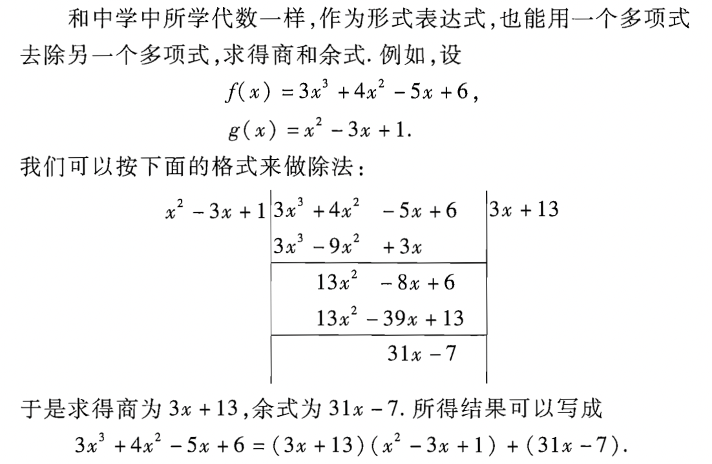

# 第一章 多项式

注意事项：

本书中自然数不包含零。

## 1.数域

代数性质：关于数的加、减、乘、除等运算的性质。

### 1.1  数域定义

定义：设 $P$ 是由一些复数组成的集合，其中包括 0 与 1，如果 $P$ 中任意两个数（这两个数也可以相同）的和、差、积、商（除数不为 0）仍然是 $P$ 中的数，那么 $P$  就成为一个数域。

全体有理数 $Q$ 组成的集合、全体实数 $R$ 组成的集合、全体复数 $C$ 组成的集合都是数域。

全体整数组成的集合就不是数域，因为不是任意两个整数的商都是整数。

>复数：我们把形如z=a+bi（a,b均为实数）的数称为复数，其中a称为[实部](https://baike.baidu.com/item/实部/53626919)，b称为虚部，i称为[虚数](https://baike.baidu.com/item/虚数)单位。当z的虚部等于零时，常称z为实数；当z的[虚部](https://baike.baidu.com/item/虚部/5231815)不等于零时，实部等于零时，常称z为[纯虚数](https://baike.baidu.com/item/纯虚数/3386848)。

**例1**. 所有具有形式 $a + b\sqrt{2}$  的数（其中 $a,b$ 是任何有理数）构成的一个数域。通常用 $Q(\sqrt{2})$ 来表示这个数域。显然数集 $Q(\sqrt{2})$ 包含 0 和 1，并且它对于加、减法是封闭的。现证明它对乘、除法也是封闭的。

**证**：我们知道

​	$(a + b\sqrt{2})(c + d\sqrt{2}) = (ac + abd) + (ad + bc)\sqrt{2}$

因为 $a,b,c,d$ 都是有理数，所以 $ac + 2bd, ad + bc$ 也是有理数，这就说明乘积 $(a + b\sqrt{2})(c + d\sqrt{2})$ 还在 $Q(\sqrt{2})$ 内，所以 $Q(\sqrt{2})$ 对于乘法也是封闭的。

设 $a + b\sqrt{2} \neq 0$ ，于是 $a - b\sqrt{2} \neq 0$ （为什么？），而

​	$\displaystyle \frac{c + d\sqrt{2}}{a + b\sqrt{2}} = \frac{(c + d\sqrt{2})(a - b\sqrt{2})}{(a + b\sqrt{2})(a - b\sqrt{2})} = \frac{ac - 2bd}{a^{2} - 2b^{2}} + \frac{ad - bc}{a^{2}- 2b^{2}}\sqrt{2}$ 

因为 $a,b,c,d$ 是有理数，所以 $a^{2} - 2b^{2}$ 是非零有理数，$\displaystyle\frac{ac - 2bd}{a^{2} - 2b^{2}}, \frac{ad - bc}{a^{2}- 2b^{2}}$ 也是有理数，这就证明了 $Q\sqrt{2}$ 对于除法的封闭性。

**例2**. 所有可以表成形式

​	$\displaystyle \frac{a_{0} + a_{1}\pi + ... + a_{n}\pi^{n}}{b_{0} + b_{1}\pi + ... + b_{m}\pi^{m}}$

的数组成一数域，其中 $n,m$ 为任意非负整数， $a_{i}, b_{m} (i = 0,...,n;j=0,..,m)$ 是整数。求验证。

**例3**.所有奇数组成的数集，对于乘法是封闭的，但对于加、减法不是封闭的。$\sqrt{2}$ 的整倍数的全体成一数集，它对于加、减法是封闭的，但对于乘除法不封闭。当然，以上这两个数集都不是数域。

### 1.2 数域的重要性质

重要性质：所有的数域都包含有理数域作为它的一部分。**

> 事实上，设 $P$ 是一个数域，由定义， $P$ 含有 1 ，根据 $P$ 对假发的封闭性， $1 + 1 = 2, 2+ 1 = 3,..., n + 1 = n + 1,...$ 全在 $P$ 中，换句话说， $P$ 包含全体自然数。又因 0 在 $P$ 中，再有 $P$ 对减法的封闭性， $0-n = -n$ 也在 $P$ 中，因而 $P$ 包含全体整数。任何一个有理数都可以表示成两个整数的商，由 $P$ 对处罚的封闭性即得以上结论。

##  2.一元多项式

### 2.1 一元多项式

定义：设 $n$ 是一非负整数，形式表达式

​	$a_{n}x^{n} + a_{n-1}x^{n-1} + ... + a_{0},$		(1)

其中 $a_{0},a_{1},...,a_{n}$ 全属于数域 $P$ ，称为**系数在数域 $P$ 中的一个一元多项式**，或者简称为**数域 $P$ 上的一元多项式**。

在多项式中，$a_{i}x^{k}$ 成为 **$k$ 次项**， $a_{i}$ 称为 $k$ 次项的**系数**。

### 2.2 相等&零多项式

定义：如果在多项式 $f(x)$ 与 $g(x)$ 中，除去系数为 0 的项外，同次项的系数全相等，那么 $f(x)$ 与 $g(x)$ 就称为相等，记为

​	$f(x) = g(x)$

系数权威 0 的多项式成为 零多项式，记为 0 。

在 (1) 中，如果 $a_{n} \neq 0$，那么 $a_{n}x^{n}$ 称为多项式 (1) 的首项，$a_{n}$ 称为首项系数，  $n$ 称为多项式 (1) 的次数。零多项式是**唯一不定义次数**的多项式，多项式 $f(x)$ 的次数记为

​	$\partial (f(x))$

####  2.2.1 多项式的次数

设

​	$f(x) = a_{n}x^{n} + a_{n-1}x^{n-1} + ... + a_{0}$

​	$g(x) = b_{m}x^{m} + b_{m-1}x^{m-1}+ ... +b_{0}$

是数域 $P$ 上两个多项式，那么可以写成

​	$\displaystyle f(x) = \sum^{n}_{i=0}a_{i}x^{i}$

​	$\displaystyle g(x) = \sum^{m}_{j=0}b_{j}x^{j}$

在表示 $f(x)$ 与 $g(x)$ 的和时，如果 $n \geq m$ ，为了方便起见，在 $f(x)$ 中令 $b_{m+1}=...=b_{n-1}=b_{n}=0$ ，

那么 $f(x)$ 与 $g(x)$ 的和为

​	$\displaystyle f(x) + g(x) =\sum_{i=0}^{n}(a_{i} + b_{i})x^{i}$

那么 $f(x)$ 与 $g(x)$ 的乘积为

​	$\displaystyle f(x)g(x)=\sum^{m+n}_{s=0}(\sum_{i+j=s}a_{i}b_{j})x^{s}$

显然**数域 $P$ 上的两个多项式经过加、减、乘、除等运算后，所得的结果仍然是数域 $P$ 上的多项式**。

对于多项式的加减法，不难看出

​	$\part (f(x) \pm g(x)) \leq max(\part(f(x)),\part(g(x)))$

对于多项式的乘法，可以证明，**如果 $f(x) \neq 0, g(x) \neq 0$ ，那么 $f(x)g(x) \neq 0$ ，并且**

​	$\part(f(x)g(x)) = \part(f(x)) + \part(g(x))$

#### 2.2.2 首项系数

#### 

设

​	$f(x) = a_{n}x^{n} + a_{n-1}x^{n-1} + ... + a_{0}$

​	$g(x) = b_{m}x^{m} + b_{m-1}x^{m-1}+ ... +b_{0}$

其中 $a_{n} \neq 0, b_{n} \neq 0$ ，于是 $f(x)g(x)$ 的首项是

​	$a_{n}b_{m}x^{m+n}$

由上可知，多项式乘积的首项系数就等于因子首项系数的乘积。

#### 2.2.3 加减乘除

和数的运算一样，多项式的运算也满足下面的一些规律

##### (1) 加法交换律

​	$f(x) + g(x) = g(x) + f(x)$

##### (2) 加法结合律

​	$(f(x) + g(x)) + h(x) = f(x) + (g(x) + f(x))$

##### (3) 乘法交换律

​	$f(x)g(x) = g(x)f(x)$

##### (4) 乘法结合律

​	$(f(x)g(x))h(x) = f(x)(g(x)h(x))$

##### (5) 乘法对加法的分配律

​	$f(x)(g(x) + h(x)) = f(x)g(x) + f(x)h(x)$$

##### (6) 乘法消去律

如果 $f(x)g(x) = f(x)h(x)$ 且 $f(x) \neq 0$ ，那么

​	$g(x) = h(x)$

##### * 证乘法结合律：

设

 	$\displaystyle f(x) = \sum^{n}_{i=0} a_{i}x^{i}, g(x) = \sum_{j=0}^{m} = b_{j}x^{j}, h(x) = \sum_{k=0}^{l}c_{k}x^{k}$

现来证

​	$(f(x)g(x))h(x) = f(x)(g(x)h(x))$

等式左边， $f(x)g(x)$中 $s$ 次项的系数为

​	$\displaystyle\sum_{i+j=s}a_{i}b_{j}$

因此左边 $t$ 次项的系数为

​	$\displaystyle \sum_{s+k=t}(\sum_{i+j=s} a_{i}b_{j})c_{k} = \sum_{i+j+k = t}a_{i}b_{j}c_{k}$

在右边， $g(x)h(x)$ 中 $r$ 次项的系数为

​	$\displaystyle \sum_{j+k = r}b_{j}c_{k}$

因此右边的 $t$ 次项的系数为

​	$\displaystyle \sum_{i+r = t}a_{i}(\sum_{j+k = r}b_{j}c_{k}) = \sum_{i+j+k = t}a_{i}b_{j}c_{k}$

与昨天 $t$ 次项的系数一样，所以左、右两边相等，这就证明了乘法满足结合律。

##### * 证乘法消去律：

如果 $f(x)g(x)=f(x)h(x)$ 且 $f(x) \neq 0$ ，那么 $g(x) = h(x)$

因为

​	$f(x)g(x) = f(x)h(x)$

有 

​	$f(x)(g(x) - h(x)) = 0$

而 $f(x) \neq = 0$ ，所以 $g(x) - h(x) = 0$ ，也就是

​	$g(x) = h(x)$

#### 2.3 一元多项式环

所有系数在数域 $P$ 中的一元多项式的全体，成为数域 $P$ 上的一元多项式环，记为 $P[x]$ ，$P$ 称为 $P[x]$ 的系数域。

## 3.整除的概念

这一节以及后面各节的讨论都是在某一个固定的数域 $P$ 上的多项式环 $P[x]$ 中进行的。

\* 多项式的除法：

#### 3.1 带余除法

对于 $P[x]$ 中任意两个多项式 $f(x)$ 与 $ g(x)$ ，其中 $g(x) \neq 0$  ，一定有 $P[x]$ 中的多项式 $q(x)$ ，$r(x)$ 存在，使

​	$f(x) = q(x)g(x) + r(x)$  	(1)

成立，其中 $\part(r(x)) < \part(g(x))$ 或者 $r(x) = 0$ ，并且这样的 $q(x), r(x)$ 是唯一决定的。

带余除法中所得的 $q(x)$ 同城称为 $g(x)$ 除 $f(x)$ 的商式，$r(x)$ 称为 $g(x)$ 除 $f(x)$ 的余式，简称商及余。

数域 $P$ 上的多项式 $g(x)$ 称为整除 $f(x)$ ，如果有数域 $P$ 上的多项式 $h(x)$ 使等式

​	$f(x) = h(x)g(x)$

成立，我们用  $g(x)|f(x)$ 表示 $g(x)$ 整除 $f(x)$ ，用 $g(x)\nmid f(x)$ 表示 $g(x)$ 不能整除 $f(x)$。

当  $g(x)|f(x)$ 成立时， $g(x)$ 称为 $f(x)$ 的因式，$f(x)$ 称为 $g(x)$ 的倍式。

**证明** : 

* 存在性：

  (1) 中 $q(x)$ 和 $r(x)$ 的存在性可以由上面除法直接得出。

  我们用归纳法的语言来叙述：

  如果 $f(x) = 0$ ，取 $q(x)=r(x)=0$ 即可。

  如果 $f(x) \neq 0$ ，令 $f(x),g(x)$ 的次数分别为 $n,m$ ，对 $f(x)$ 的次数 $n$ 作（第二）数学归纳法

  ​	当 $n < m$ 时，显然取 $q(x) = 0, r(x) = f(x)$ ，(1) 式成立；

  ​	当 $n \geq m$ 时，令 $ax^{n}, bx^{m}$ 分别是 $f(x), g(x)$ 的首项，

  ​	而 $\displaystyle \frac{a}{b}x^{n-m}g(x)$ 与 $f(x)$ 有相同的首项，因而多项式

  ​		$\displaystyle f_{1}(x) = f(x) - \frac{a}{b}x^{n-m}g(x)$ 

  ​	的次数小于 $n$ 或为 0 。

  ​			若为 0，则 $\displaystyle q(x) = \frac{a}{b}x^{n-m}, r(x) = 0$ ;

  ​			若次数小于 $n$ ，对 $f_{1}(x), g(x)$ 和 $q_{1}(x), r_{1}(x)$ 存在，使得

  ​				$f_{1} (x) = q_{1}(x)g(x) + r_{1}(x)$

  ​			其中 $\part(r_{1}(x)) < \part(g(x))$ 或者 $r_{1}(x) = 0$ ，于是

  ​				$\displaystyle f(x) = (q_{1}(x) + \frac{a}{b}x^{n-m})g(x) + r_{1}(x)$

  ​			也就是说，有 $\displaystyle q(x) = q_{1}(x) + \frac{a}{b}x^{n-m},r(x)= r_{1}(x)$ 使得

  ​				$f(x) = q(x)g(x) + r(x)$

  ​			成立。

​	由归纳法原理，对任意的 $f(x), g(x) \neq 0, a(x), r(x)$ 的存在性就证明了。

* 唯一性

  设另有多项式 $q'(x),r'(x)$ 使

  ​	$f(x) = q'(x)g(x) + r'(x)$

  其中 $\part(r'(x)) < \part(g(x))$ 或者 $r'(x) = 0$。于是

  ​	$q(x)g(x) + r(x) = q'(x)g(x) + r'(x)$

  即

  ​	$(q(x)-q'(x))g(x) = r'(x)-r(x)$

  如果 $q(x) \neq q'(x)$ ，又据假设 $g(x) \neq 0$ ，那么 $r'(x) - r(x) \neq 0$ 且有

  ​	$\part(q(x) - q'(x)) + \part(g(x)) = \part(r'(x) - r(x))$

  但是 

  ​	$\part(g(x)) > \part(r'(x) - r(x))$

  所以上式不可能成立，这就证明了 $q(x) = q'(x)$ ，因此 $r(x) = r'(x)$

#### 3.2 带余除法 判别定理

当 $g(x) \neq 0$ 时，带余除法给出了整除性的一个判别法。

**定理**：对于数域 $P$ 商的任意两个多项式 $f(x), g(x)$ ，其中 $g(x) \neq 0$ ，$g(x) \mid g(x)$ 的充分必要条件是 $g(x)$ 除 $f(x)$ 的余式为零。

**证明**：

如果 $r(x) = 0$ ，那么 $f(x) = q(x)g(x)$ ，即 $g(x) \mid f(x)$ 。

反过来，如果 $g(x) \mid g(x)$ ，那么

​	$f(x) = q(x)g(x) + 0$

即 $r(x) = 0$ 。

#### 3.3整除性的几个常用性质

带余除法中 $g(x)$ 必须不为 0，但 $g(x)\mid f(x)$ 中， $g(x)$ 可以为 0。这时 $f(x) = g(x)h(x) = 0 \cdot h(x) = 0$ 。

当 $g(x) \mid f(x)$ 时，如果 $g(x) \neq 0, g(x)$ 除 $f(x)$ 所得的商 $q(x)$ 有时也用 $\displaystyle\frac{f(x)}{g(x)}$ 来表示。

又整除的定义还可看出，任一个多项式 $f(x)$ 一定整除它自身，即 $f(x)\mid f(x)$ ，因为 $f(x) = 1 \cdot f(x)$ 。

任一个多项式 $f(x)$ 都整除**零**多项式 0，因为 $0=0\cdot f(x)$ 。

**零次**多项式，也就是非零常数，能整除任一个多项式，因为当 $a\neq 0$ 时， $\displaystyle f(x) = a(\frac{1}{a}f(x))$ 。

##### (1)

如果 $f(x)\mid g(x), g(x) \mid f(x)$，那么 $f(x) = cg(x)$ ，其中 $c$ 为非零常数。

**证**：

由 $f(x) \mid g(x)$ 有 $g(x) = h_{1}(x)f(x)$ ，

由 $g(x) \mid f(x)$ 有 $f(x) = h_{2}(x)g(x)$ ，

于是

​	$f(x)=h_{1}(x)h_{2}(x)f(x)$

即 

​	$1 = h_{1}(x)h_{2}(x)$

从而

​	$\part(h_{1}(x)) + \part(h_{2}(x)) = 0$

由此可得

​	$\part(h_{1}(x)) = \part(h_{2}(x)) = 0$

这就是说 $h_{2}(x),h_{1}(x)$ 是一个非零常数。

##### (2) 整除的传递性

如果 $f(x)\mid g(x)，g(x)\mid h(x)$ ，那么 $f(x) \mid h(x)$  

**证**：

由 $g(x) = g_{1}(x)f(x), h(x)=h_{1}(x)g(x)$ 

可得 $h(x) = (h_{1}(x)g_{1}(x))f(x)$

##### (3)

如果 $f(x) \mid g_{i}(x), i=1,2,...,r$ ，那么

​	$f(x)\mid u_{1}(x)g_{1}(x) + u_{2}(x)g_{2}(x) + ... + u_{r}(x)g_{r}(x)$

其中 $u_{i}(x)$ 是数域 $P$ 上任意的多项式。

通常 $u_{1}(x)g_{1}(x) + u_{2}(x)g_{2}(x) + ... + u_{r}(x)g_{r}(x)$ 称为多项式 $g_{1}(x), g_{2}(x), ... , g_{r}(x)$ 的一个**组合**。

**证**:

由 $g_{i}(x) = h_{i}(x)f(x), i= 1,2,...,r$  ，即得

​	$u_{1}(x)g_{1}(x) + u_{2}(x)g_{2}(x) + ... + u_{r}(x)g_{r}(x) = [u_{1}(x)h_{1}(x) + u_{1}(x)h_{1}(x) + ... + u_{r}(x)h_{r}(x)]f(x)$

* 由以上性质可以看出，多项式 $f(x)$ 与它的任一个非零常数倍 $cf(x)$ 有相同的因式，也有相同的倍式，因之，在多项式正出新高度讨论中，$f(x)$ 常常可以用 $cf(x)$ 来代替。
* 两个多项式之间的整除关系不因为系数域的扩大而改变。也就是说，如果 $f(x),g(x)$ 是 $P[x]$ 中两个多项式， $\overline{P}$ 是包含 $P$ 的一个较大的数域，当然， $f(x),g(x)$ 也可以看成是 $\overline{P}[x]$ 中的多项式。从带余除法可以看出，不论吧 $f(x),g(x)$ 看成是 $P[x]$ 中或是 $\overline{P}[x]$ 中的多项式，用 $g(x)$ 去除 $f(x)$ 所得的商式及余式都是一样的。因此，如果 $P[x]$ 中 $g(x)$ 不能整除 $f(x)$，那么 $\overline{P}[x]$ 中，$g(x)$ 也不能整除 $f(x)$ 。

