# 映射与函数

##  一.映射与函数

### 1.集合的概念

具有某种特定性质的事物的总体称为集合。

组成集合的事物称为元素。

不含任何元素的集合称为空集，记作 $\O$ 。

元素 $a$ 属于集合 $M$，记作$a \in M$ 。

元素 $a$ 不属于集合 $M$，记作 $a \overline{\in} M$ （或 $a \notin M$）。

### 2.集合的表示法

#### (1) 列举法

按某种方式列出集合中的全体元素。

例：有限集合 $A=\{a_{1}, a_{2},..., a_{n}\} = \{a_{i}\}_{i=1}^{n}$

​		自然数集 $N=\{0,1,2,...,n,...\}= \{ n\}$

>$M$ 为数集：
>
>1.$M^{*}$ 表示 $M$ 中排除 0 的集。
>
>2.$M^{+}$ 表示 $M$ 中排除 0 与负数的集。

#### （2）描述法

$M =\{x|x$  所具有的特征 $\}$

例：整数集合 $Z=\{x| x \in N $  或  $ -x\in N^{+}\}$

​		有理数集 $\displaystyle Q = \{\frac{p}{q} , p \in Z, q \in N^{+} ,\, p $ 与 $q$   互质  $\displaystyle \}$

​		实数集合 $\displaystyle R= \{x| x $  为有理数或无理数  $\displaystyle\}$

> 两个整数互质（或互素）是指它们没有大于 1 的整数公因子。

### 3.集合之间的关系及运算

 

**定义**	设有集合 $A,B$，若 $x\in A$ 则必有 $x \in B$，则称 $A$ 是 $B$ 的子集，或称 $B$ 包含 $A$，记作 $A \subset B$。

​			若 $A \subset B$ 且 $B \subset A$，则称 $A$  与 $B$ 相等，记作 $A=B$.

例如： $N \subset Z \subset Q \subset R$

显然有下列关系：

​	（1）$A \subset A;\,A= A \,; \O \subset A$

​	（2）$A \subset B$ 且 $B \subset C \Rightarrow A\subset C$

给定两个集合 $A,B$，定义下列运算：

并集 $A \cup B = \{ x|x \in A $ 或  $ x\in B \}$

交集 $A \cap B = \{ x|x \in A $ 且  $ x\in B \}$

差集 $A \setminus B = \{ x|x \in A $ 且  $ x\notin B \}$

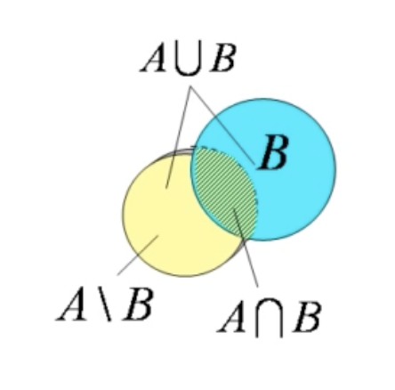

##  二.区间与领域

### 1.区间

区间：是指介于某两个实数之间的全体实数，这两个实数叫做区间的端点。

$\forall a,b \in R,$ 且 $a < b$。

$\{x| a < x < b\}$ 称为开区间，记作$(a,b)$。

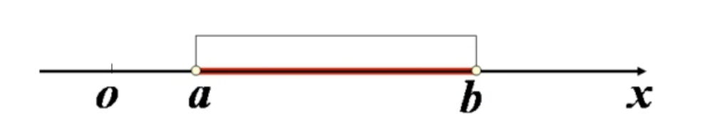

$\{x| a\leq x \leq b\}$ 称为闭区间，记作$[a,b]$。

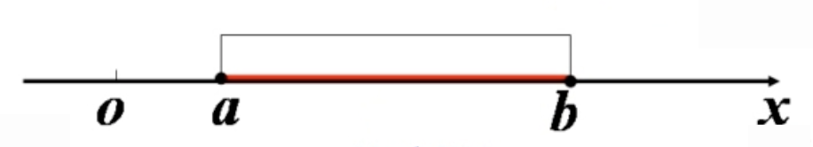

$\{x| a\leq x < b\}$ 称为半开区间，记作$[a,b)$

$\{x| a < x \leq b\}$ 称为半开区间，记作$(a,b]$

​			以上为有限区间。

无限区间：

$[a, +\infty) = \{x|a \leq x\}$

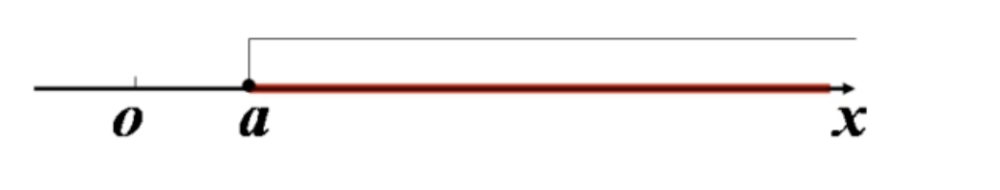

$(-\infty,b) = \{x|x < b\}$

### 2.领域

设 $x_{0} \in R, \delta > 0$，点 $x_{0}$ 的 $\delta$ 领域。

$U(x_{0}, \delta) = \{x| |x - x_{0}| < \delta\}$

​				$=\{x|x_{0} -\delta <x < x_{0} + \delta \}$

​				$=(x_{0} - \delta, x_{0} + \delta)$

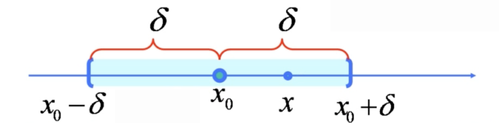

点 $x_{0}$ 的 $\delta$ 去心领域

$\overset{\circ}{U}(x_{0}, \delta) = \{x|0 <|x - x_{0}| < \delta, x\neq x_{0}$

​				$=\{x|x_{0} -\delta <x < x_{0} + \delta, x\neq x_{0} \}$

​				$=(x_{0}-\delta, x_{0}) \cup (x_{0}, x_{0} + \delta) $

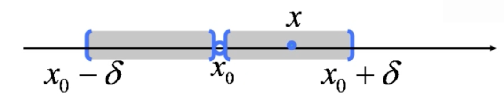

## 三.映射

### 1.映射的概念

设 $X,Y$ 是集合。

若 $\forall x \in X$，$\exists$ 唯一的 $y \in Y$，使得

​				$f:x \rightarrow y$

则称 $f$ 为 $X$ 到 $Y$ 的一个映射。

记为 $y = f(x)$

>y 是 x 在 f 下的像。
>
>x 是 y 的原像

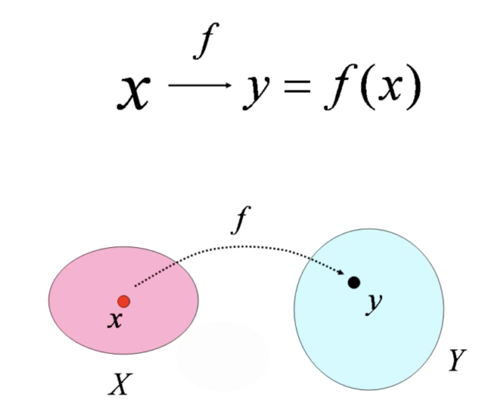

对应法则：$f$

定义域：$D_{f} = X$

值域：$R_{f} = f(X) = \{ f(x)| x \in X \}$

### 2.映射类型

#### （1）满映射（满射）

$f: X \rightarrow Y$

$\forall y \in Y, \exist x \in X \Rightarrow f(x) = y$

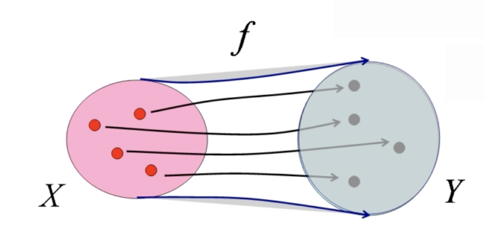

$Y$ 中每一个元素都是映射 $f$ 的像。

#### （2）非满射

$f: X \rightarrow Y$

$\exist y \in Y, \forall x \in X \Rightarrow f(x) \neq y$

#### （3）单映射（单射）

$f: X \rightarrow Y$

$\forall a, b \in X$

$a \neq b \Rightarrow f(a) \neq f(b)$  或  $f(a) = f(b) \Rightarrow a = b$

不同的元素有不同的像。(或像相同，原像也一定相同)

#### （4）非单射

$f: X \rightarrow Y$

$\exist a,b \in X, a\neq b$ ，但 $ f(a) = f(b)$

至少存在两个不同的元素有相同的像。

#### （5）一一映射（双射）

$f: X \rightarrow Y$

既单又满的映射称为双射，或一一映射。

单射 + 满射 = 双射

#### (6) 逆映射

单射很重要

>每一个单射都可以诱导一个双射。

若 $f:X \rightarrow Y$ 是单射，则 $f: X \rightarrow f(X)$ 是双射。

>每一个单射也可以诱导一个逆映射。

若 $f:X \rightarrow Y$ 是单射，则 $f:X \rightarrow Y$ 可逆

逆映射 $f^{-1}: f(X) \rightarrow X$

$\forall y \in f(X), \exist $ 唯一的 $ x \in X，f(x) = y \Rightarrow f^{-1}: y \rightarrow x$

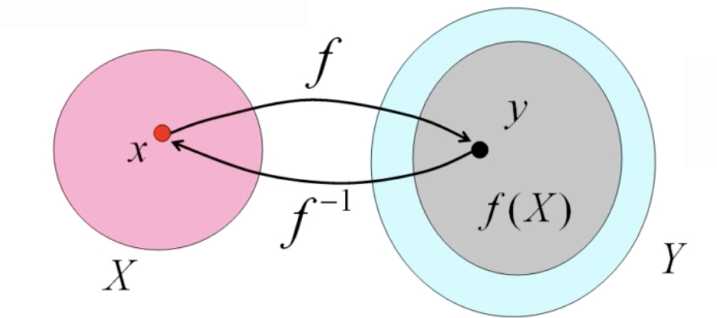

$x = f^{-1}(y)$      $y=f(x)$

## 四.函数

### 1.函数的概念

函数是数集 $X$ 到实数集 $R$ 的映射：

​		$f: X \rightarrow R$  ， $X \subseteq R$

设 $f:x \rightarrow y$ ，记 $y = f(x)$

对应法则：$f$

定义域：$D_{f} = X$

值域：$R_{f} = f(X) = \{ f(x)| x \in X \}$

### 2.函数的图形

$f: X \rightarrow R$

$G  = \{(x, f(x))| x \in D_{f} \}$

### 3.反函数

若函数 $y = f(x)$ 是单射：

​	$x_{1} \neq x_{2} \Rightarrow f(x_{1}) \neq f(x_{2})$

则函数 $f$ 可逆，逆映射

​	$x = f^{-1}(y)$  其中 $y = f(x) \in f(D)$

就是 $y = f(x)$ （称为直接函数）的反函数。

​	$y=f^{-1}(x)$

**单调函数的反函数也是同类单调函数**

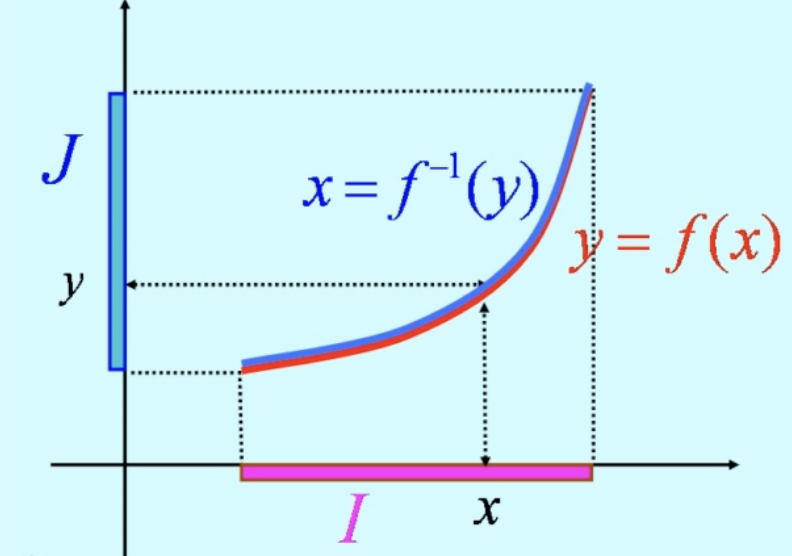

如果直接函数是单增，则反函数也是单增；

如果直接函数是单减，则反函数也是单减。

**一个函数有反函数的条件是什么?**

定理（反函数的存在性）

一个函数有反函数的条件是它是一个单映射。

单调函数一定有反函数。

**反函数的图形**

反函数的图形与直接函数的图形是同一个图形，且关于直线 $y=x$ 对称。

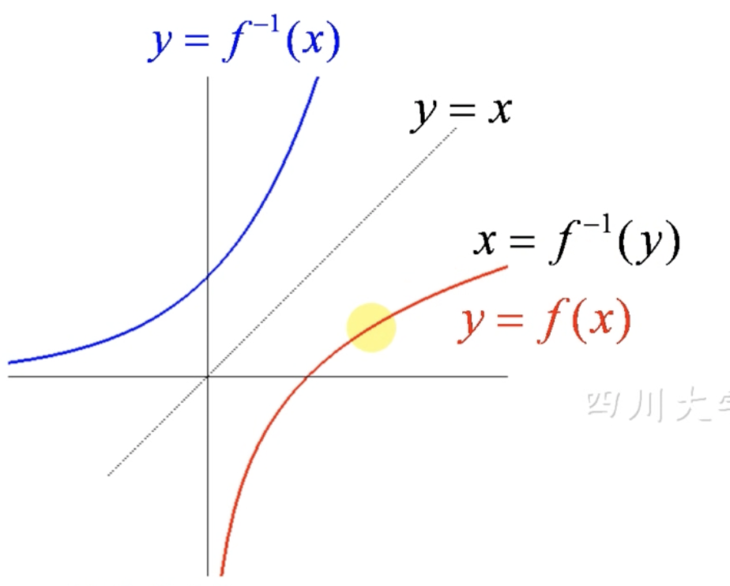

### 4.几个分段函数

在不同的范围（区间）用不同的数学表达式来表示的函数称为分段函数。

几个重要的分段函数：

#### 4.1 绝对值函数

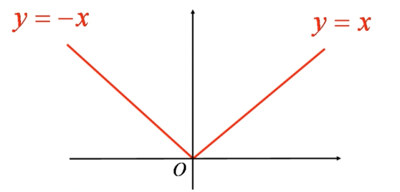

$\displaystyle y = |x|= \left \{\begin{matrix} x & x\geq 0 \\ -x& x<0 \end{matrix}\right.$

定义域：$(-\infty, +\infty)$

​	值域：$[0, +\infty)$

它是偶函数。

* 几何意义：$|x| = x$ 与 0 之间的距离。

​						   $|x - a| = x$ 与 $a$ 之间的距离。

* 性质：

  $x \geq 0 \Leftrightarrow |x| = x$       $x\leq 0 \Leftrightarrow |x| = -x$

  $|x| \leq M \Leftrightarrow-M \leq x \leq M$

  $|x|\geq M \Leftrightarrow x \geq M$ 或 $x \leq -M$

  $|x-x_{0}|\leq M \Leftrightarrow x_{0}-M \leq x \leq x_{0} + M$

  $|x - x_{0}|\geq M \Leftrightarrow x\leq x_{0} - M$ 或 $x \geq x_{0} + M$

#### 4.2 符号函数

$\displaystyle y= sgn(x) = \left\{\begin{matrix} 1 &x>0 \\ 0 &x=0\\ -1 &x<0\end{matrix}\right.$

定义域：$(-\infty, +\infty)$

​    值域：$\{-1,0,1\}$

图形关于原点堆成，它是奇函数。

* 性质：对任何实数 $x$ ，有

  $x = sgn(x) \cdot|x|$		$\displaystyle |x| = sgn(x) \cdot x \Rightarrow sgn(x) = \frac{x}{|x|} = \frac{|x|}{x} \,(x\neq 0)$

  

  $x > 0 \Leftrightarrow sgn(x) = 1$

  $x < 0 \Leftrightarrow sgn(x) = -1$

  $x > a \Leftrightarrow sgn(x - a) = 1$

    

#### 4.3 取整函数

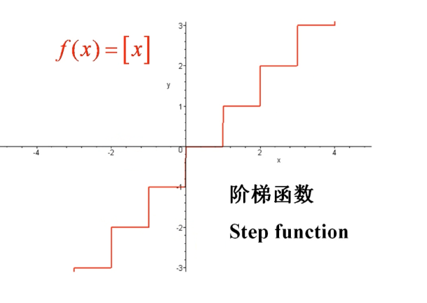

$f(x) = [x]$

其中 $[x]$ 表示小于或等于 $x$ 的最大整数，$[x] = max \{x \in Z | n \leq x\}$

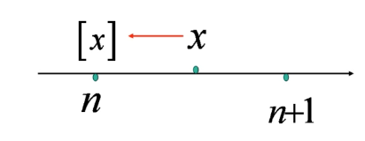

$[x] = \left\lfloor x \right\rfloor$ 向左取整，向下取整

* 性质：

  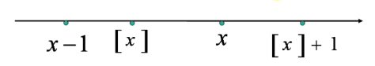

  1.$\forall x \in R$ ，$x - 1 < [x] \leq x < [x] + 1$。

  2.$\forall x \in R$ ，$x$ 是整数当且仅当 $x = [x]$ 。

  

取整函数也是分段函数： $f(x) = [x] = n, n\leq x <n+1 \,(n =0, \pm1, \pm2,...)$

> 向上取整：$f(x) = ceil(x) = min\{n \in Z | n \geq x\} = \left\lceil x \right\rceil$
>
> 向零取整：$f(x) = trunc(x)$ ，例：$trunc(2.5) = 2,\, trunc(-2.5) = -2$
>
> 四舍五入函数：$f(x) = round(x)$

### 5.函数的几种特性

#### 5.1 有界性

设集合 $X \subseteq D_{f}$ （函数 $f(x)$ 的定义域），如果

$\exist M > 0$ ，$\forall x \in X$，使得 $|f(x)| \leq M $      

则称函数 $f(x)$ 在集合 $X$ 上有界。

 $\forall M>0$ ，$\exists x \in X$ ，使得 $|f(x)| > M$ 

则称函数 $f(x)$ 在集合 $X$ 上 无界。

$\exists A \in R$ ，$\forall x \in X$ ，使得 $f(x) \geq A$

则称函数 $f(x)$ 在集合 $X$ 上有下界（A 是下界）。

$\exists B \in R$ ，$\forall x \in X$ ，使得 $f(x) \leq B$

则成函数 $f(x)$ 在集合 $X$ 上有上界（B 是上界）。

* 有界性的另一个方便的刻画：

  命题：函数 $f(x)$ 在集合 $X$ 上有界的充分必要条件是它在 $X$ 上既有上界又有下界。

  证：必要性		若函数 $f(x)$ 在 $X$ 上有界，

  则存在 $M > 0$ ，使得 $-M \leq f(x) \leq M$

  所以 $f(x)$ 在 $X$ 上有上界 $M$ 和下界 $-M$ 。

  充分性	若函数 $f(x)$ 在 $X$ 上既有上界 B 又有下界 A ，即 $A\leq f(x) \leq B$ 

  令 $M = max\{|A|, |B|\}$ ，

  则 $-M \leq A \leq f(x) \leq B \leq M$

  得 $|f(x)| \leq M$

  所以 $f(x)$ 在集合 $X$ 上有界。

> 函数的有界性与集合 $X$ 有关。
>
> 对于 $\displaystyle f(x) = \frac{1}{x}$ ，在 $(0,1]$ 内无界，在 $[1, +\infty)$ 内有界。

* 常见的有界函数（在其定义域内有界，整体有界函数）

  $|sinx| <\leq 1$

  $|cosx| \leq 1$

  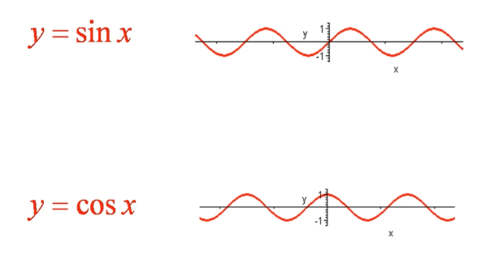

  $\displaystyle -\frac{\pi}{2} < arctanx < \frac{\pi}{2}$

  $0 < arccotx < \pi$

  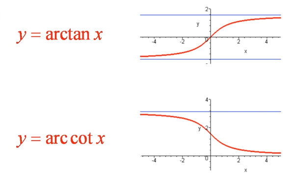

  $\displaystyle 0 < \frac{1}{1 + x^{2}} \leq 1$

  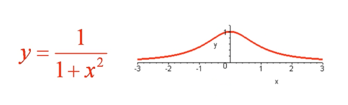

注意：

只要外函数有界，复合函数必有界。

$\displaystyle sin\frac{1}{x}$ 	$sin(3x^{2} + 1)$ 	$\displaystyle arctan\frac{3}{1 + x}$

$\Rightarrow$

$\displaystyle|sin\frac{1}{x}| \leq 1$ 	$|sinx(3x^{2} + 1)| \leq 1$ 	$\displaystyle|arctan\frac{3}{1 + x}| < \frac{\pi}{2}$

* 几个重要的无界函数：

  $y = xsinx$	在 $(-\infty, +\infty)$ 内无界。

  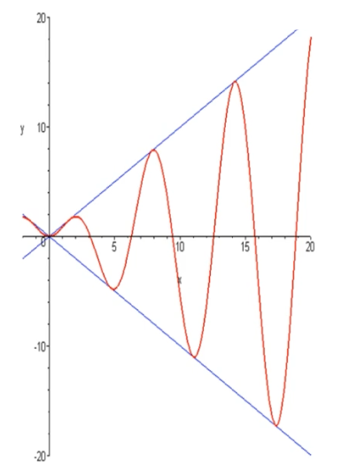

  

  $\displaystyle y = \frac{1}{x}sin\frac{1}{x}$ 	在 $(1, +\infty)$ 内有界，在 $(0, 1)$ 内无界。

  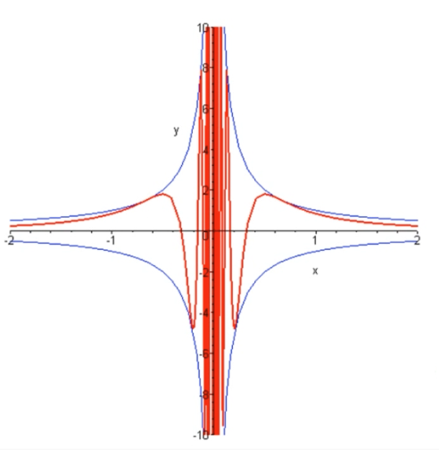

#### 5.2 单调性

设函数 $I$ 是函数 $f(x)$ 的定义域内的一个区间。

$\forall x_{1},x_{2} \in I$ 	$x_{1} < x_{2} \Rightarrow f(x_{1}) < f(x_{2})$ 

则函数 $f(x)$ 在区间 $I$ 上单调增加。

$\forall x_{1}, x_{2} \in I$ 	$x_{1} < x_{2} \Rightarrow f(x_{1}) > f(x_{2})$

则函数 $f(x)$ 在区间 $I$ 上单调减少。

在一个区间上单调增加或单调减少的函数称为单调函数。

* 讨论函数在指定区间单调性的方法：

1.可以对式子进行转化，控制 x 的出现次数，从而判断单调性。

2.设 $x_{1} < x_{2} \in I$ ，通过 $f(x_{2}) - f(x_{1})$ 是否为正来判断，大于 0 则单增，小于 0 则单减。

3.设 $x_{1} < x_{2} \in I$ ，通过 $\displaystyle \frac{f(x_{2})}{f(x_{1})}$ 是否大于 1 来判断，大于 1 则单增，小于 1 则单减。

4.利用函数的导数的符号来判定函数的单调性。

#### 5.3 奇偶性

设函数 $f(x)$ 的定义域 $D$  关于原点对称 ，即 $x \in D \Rightarrow -x \in D$ 

$\forall x \in D$	$f(x) = f(-x)$

则称函数 $f(x)$ 是偶函数。

$\forall x \in D$	 $f(-x) = -f(x)$

则称函数 $f(x)$ 是奇函数。

偶函数图形关于 y 轴对称，奇函数的图形关于原点对称。

> 若奇函数 $f(x)$ 在 0 处有定义，则必有 $f(0) = 0$ 。

##### 函数的奇偶分解：

设函数 $f(x)$ 的定义域关于原点对称>，

则

$\displaystyle g(x)= \frac{f(x) + f(-x)}{2}$ 是偶函数：$g(-x) = g(x)$

$\displaystyle h(x) = \frac{f(x) - f(-x)}{2}$ 是奇函数：$h(-x) = -h(x)$

且 $f(x) = g(x) + h(x)$

所以，

如果函数 $f(x)$ 的定义域关于原点对称，

则

​	$f(x) + f(-x)$ 是偶函数

​	$f(x) - f(-x)$ 是奇函数。

例如指数函数 $\displaystyle y = e^{x} (-\infty < x < + \infty)$

$\displaystyle chx =\frac{e^{x} + e^{-x}}{2}$ 是偶函数	称为双曲余弦。

$\displaystyle shx = \frac{e^{x} - e^{-x}}{2}$ 是奇函数	称为双曲正弦。

* 讨论函数奇偶性：

  1.首先判断定义域是否关于原点对称 ，如果定义域不对称，则该函数没有奇偶性。

  2.可以通过将函数转化成 $a-b$ 或 $a + b$ 的格式，再通过函数的奇偶分解来判断。

  3.将 $f(-x)$ 代入转化，得出结果 $f(-x) = -f(x)$。

例如：

$f(x) = ln(x + \sqrt{x^{2} + 1})$ 

解：函数的定义域是 $(-\infty, +\infty)$ 

$\displaystyle f(-x) = ln(-x + \sqrt{(-x)^{2} + 1}) = ln(-x + \sqrt{x^{2} + 1}) $ 

​			$\displaystyle = \frac{x^{2} + 1 - x^{2}}{x + \sqrt{x^{2} + 1}} = \frac{1}{x + \sqrt{x^{2} + 1}} = -ln(x+ \sqrt{x^{2} + 1}) = -f(x)$

所以函数是奇函数。

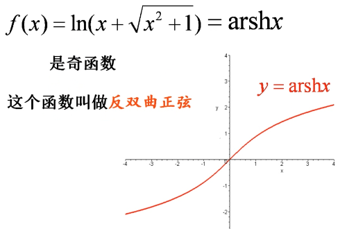

#### 5.4 周期性

设函数 $f(x)$ 的定义域为 $D$。

如果存在一个正数 $l$，使得 $\forall x \in D \Rightarrow x \pm l \in D$

且 $f(x + l) = f(x)$ 恒成立，

则称 $f(x)$ 为以 $l$ 为周期的周期函数。

> 若 $l$ 是函数 $f(x)$ 的周期，则 $2l,3l,...$ 也是函数的周期。通常我们说的周期是函数的最小正周期。

##### 常见的周期函数

| 函数              | 最小正周期                               |
| ----------------- | ---------------------------------------- |
| $sinx$     $cosx$ | $l=2\pi$                                 |
| $tanx$     $cotx$ | $l = \pi$                                |
| $C$ （常数）      | 以任何整数为周期 （没有最小正周期） |

* 若函数 $f(x)$ 以 $l$ 为周期数，则 $f(ax + b)$ 以 $\displaystyle\frac{l}{a}$  （$a > 0$）为周期。
* 狄利克雷函数是没有最小正周期的周期函数，每一个正有理数都是函数的周期。

证明: $\displaystyle D(x) = \left\{\begin{matrix} 1&，当 x 是有理数 \\ 0 &，当x时无理数 \end{matrix}\right.$ 	狄利克雷函数以任何有理数为周期。

证：设 $l$ 是一个正有理数， $\forall x \in R$

若 $x$ 是有理数，则 $x + l$ 也是有理数，有 $D(x + l) = 1 = D(x)$

若 $x$ 是无理数，则 $x+ l$ 也是无理数，有 $D(x + l) = 0 = D(x)$

##### 复合函数的周期性

设函数 $y = f(u)$ 的定义域为 $D_{f}$ ，

函数 $u=g(x)$ 的 定义域为 $D_{g}$ ，值域为 $R_{g}$ 。

若集合 $D = \{x \in D_{g} | g(x) \in D_{f}\}\neq \O$

则由下式确定一个 $D$ 上的函数

​		$y = f[g(x)] (x \in D)$

称为函数 $y = f(u)$ 和 $u = g(x)$ 的复合函数。

$y=f(u)$ 称为外函数， $u=g(x)$ 称为内函数。$u$ 为中间变量。

例如，

$y = f(u) = \sqrt{u}$ 的定义域 $D_{f} = [0, +\infty)$

$u=g(x) = 1- x^{2}$ 的定义域 $D_{g} = (-\infty, +\infty)$ ，值域 $R_{g} = (-\infty, 1]$

$D = \{x \in D_{g} | g(x) \in D_{f} \} = \{x |1-x^{2} \geq 0\} = [-1, 1] \neq \O$

$f(u)$ 和 $g(x)$ 可以构成 $D$ 上的复合函数：

   $y=f[g(x)] = \sqrt{1-x^{2}}(-1 \leq x\leq 1)$

复合函数的定义域一般是内函数定义域的一个子集。

又如，

$y=f(u)=\sqrt{u}$          的定义域 $D_{f} = [0,+\infty)$

$u=g(x) = -1-x^{2}$ 的定义域 $D_{g} = (-\infty, +\infty)$ ，值域 $R_{g} = (-\infty, -1]$

$D=\{x\in D_{g} | g(x) \in D_{f}\} = \{x| -1-x^{2} \geq 0\}= \O$

$f(x)$ 和 $g(x)$ 不能构成复合函数。

并非每两个函数都能构成复合函数。

> 函数的复合可以涉及两个以上的函数。

教材 17 页 13 题

设 $\displaystyle f(x) = \left\{\begin{matrix} 1,&|x|<1 \\ 0, &|x|=1 \\ -1,&|x|>1\end{matrix}\right.$		$g(x) = e^{x}$ ，

求 $f[g(x)]$ 和 $g[f(x)]$ ，并作图。

$\displaystyle f[g(x)] = \left\{\begin{matrix} 1, &|g(x)|=e^{x}<1 \\ 0,&|g(x)|=e^{x}=1 \\ -1, &|g(x)|=e^{x} > 1     \end{matrix}\right. = \left\{\begin{matrix}1, & x<0 \\ 0, &x=0 \\ -1,&x>0 \end{matrix}\right. = -sgnx$

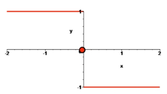

$\displaystyle g[f(x)]=\left\{\begin{matrix}e^{1}, &|x|<1 \\ 1, &|x|=1 \\ e^{-1}, &|x|>1  \end{matrix}\right. $

### 6.初等函数

由常数和基本初等函数经过有限次四则运算和复合，并且能用一个公式表示的函数。

> 分段函数一般不是初等函数，因为它不能用一个公式表示。
>
> 同理，符号函数和取整函数都不是初等函数。
>
> 但是，绝对值函数 $\displaystyle y = |x| = \left\{\begin{matrix} -x, &x < 0 \\ x, &x> 0 \end{matrix}\right.$ 也可以写成 $y = \sqrt{x^{2}}$ ，所以绝对值函数式初等函数。

基本初等函数（五类）

[1.幂函数](../初等函数/幂函数.md)

[2.指数函数](../初等函数/指数函数.md)

[3.对数函数](../初等函数/对数函数.md)

[4&5.三角函数&反三角函数](../初等函数/三角函数&反三角函数.md)

初等函数在其单调区间内有反函数，2和3 、4和5 互为反函数。而1的反函数还是1。

### 7.双曲函数

在一些工程应用中，会涉及到一些与指数函数 $e^{x}$ 有关的函数。这就是即将介绍的双曲函数。

设函数 $f(x)$ 的定义域关于原点对称，则 $f(x)$ 可以分解成一个奇函数和一个偶函数的和

现将指数函数 $e^{x}$ 作这样的分解：

#### 7.1 双曲正弦

$\displaystyle y = sinhx = shx = \frac{e^{x} - e^{-x}}{2} $

它是奇函数，它的定义域和值域都是一切实数，它还是单调增加的函数。

#### 7.2 双曲余弦

$\displaystyle y = coshx = chx = \frac{e^{x} + e^{-x}}{2}$

它是偶函数，定义域是一切实数，值域是 $[1, +\infty)$ ，最小值在 0 处取得 $ch(0) = 1。

* 双曲函数及其渐进曲线

  

> 双曲余弦 $y=chx$ 的应用：悬链线。
>
> 特点：张力全在切线方向。

#### 7.3 双曲正切

$\displaystyle y = tanhx = thx = \frac{sinhx}{coshx}= \frac{e^{x} - e^{-x}}{e^{x} + e^{-x}}$

它是奇函数，奇函数与偶函数的商是奇函数。定义域是一切实数，值域是 $(-1,1)$ 。

#### 7.4 双曲余切

$\displaystyle y = cothx = cthx = \frac{coshx}{sinhx} = \frac{e^{x} + e^{-x}}{e^{x} - e^{-x}}$

它是奇函数，奇函数与偶函数的商是奇函数。定义域是一切非零实数，值域是 $|x| > 1$ 。

#### 7.5 运算

双曲函数的运算性质与三角函数有很多类似或可比较的地方：

### 8.反双曲函数

#### 8.1 反双曲正弦

$y = shx$ 是单调增加的函数，故有反函数。

$\displaystyle y = shx = \frac{e^{x} - e^{-x}}{2}$ 		$\displaystyle 2y = e^{x} - e^{-x} = e^{x} - \frac{1}{e^{x}}$

令 $u = e^{x}$ ，$\displaystyle 2y = u - \frac{1}{u}$		$2yu = u^{2} - 1$ 	 $u^{2} - 2yu + 1 = 0$

用求根公式，$\displaystyle u = \frac{2y \pm \sqrt{(-2y)^{2} - 4(-1)}}{2} = y \pm \sqrt{y^{2} + 1}$

因为 $u = e^{x} > 0$		故 $u = y + \sqrt{y^{2}+1}$

交换 $x,y$ ，$x = \ln{(y + \sqrt{y^{2} + 1})} \Rightarrow y = arshx = \ln{(x + \sqrt{x^{2}+ 1})}$

#### 8.2 反双曲余弦

$y = chx$ 不是单调函数，固整体没有反函数。

$y = chx$ 在 $[0, +\infty)$ 上是单调增加的函数，固有反函数。

同理可得，

反双曲余弦：$y = archx = \ln{(x + \sqrt{x^{2}-1})}\,\,\,\,\,\,\,(x\geq 1)$

#### 8.3 反双曲正切

$y = thx$ 是单调增加的函数，故有反函数。

同理可得，

$\displaystyle y = arthx = \ln{\sqrt{\frac{1+x}{1-x}}} = \frac{1}{2}\ln{\frac{1+x}{1-x}} \,\,\,\,\,\,\,\,(|x| < 1)$

## 五.函数的极限

极限是微积分中的一个基本运算和方法。微积分中的很多重要概念都要用到极限来定义。很多重要的计算方法都要设计极限运算。

### 1. 函数的极限

#### 1.1 自变量趋于有限值时函数的极限

极限 $\displaystyle \lim_{x\rightarrow x_{0}} f(x) = A$ 直观的定义

设函数 $f(x)$ 在 $x = x_{0}$ 的某个去心邻域内有定义。

若 $x \rightarrow x_{0}$ 时，有 $f(x) \rightarrow A$

则称函数 $f(x)$ 在 $x_{0}$ 处有极限 A。

但是，极限的这种定义是不严格的。

如何严格定义极限 $\displaystyle \lim_{x\rightarrow x_{0}}f(x) = A$ ?

需要两个正数：$\varepsilon$ 和 $\delta$ 

$\varepsilon$ 用来表示函数值 $f(x)$ 与数 $A$ 可以无限接近： $|f(x) - A| < \varepsilon$ 。

$\delta$ 用来表示当自变量 $x$ 与 $x_{0}$ 充分接近时，$|x - x_{0}| < \delta$ ，就能保证 $f(x)$ 与 $A$ 的差距小于事先给定的 $\varepsilon$ 。

定义1 .极限的 $\varepsilon -\delta$ 定义（极限 $\displaystyle \lim_{x \rightarrow x_{0}}f(x) = A$ 的严格定义）

 $\displaystyle \lim_{x \rightarrow x_{0}}f(x) = A$  是指：

$\forall \varepsilon > 0\,\,\,\,\,\,\, \exist \delta > 0$ 使得当

$0 < |x - x_{0}| < \delta$ 时，就有

$|f(x) - A| < \varepsilon$ 成立。

> $x_{0}$ 处的极限是否存在以及极限值与函数 $f(x)$ 在 $x_{0}$ 处的函数值 $f(x_{0})$ 无关，因为定义中没哟涉及到 $f(x_{0})$ 。
>
> 即 $\displaystyle \lim_{x \rightarrow x_{0}}{f(x)} = A$ 与函数值 $f(x_{0})$ 无关。

* 当函数 $f(x) $ 在 $x_{0}$ 处有定义的时候，可直接代入 $x_{0}$ ，$A = f(x_{0})$ 。
* 当函数 $f(x)$ 在 $x_{0}$ 处没有定义的时候，可对 $f(x)$ 进行因式分解，得到一个可代入 $x_{0}$ 的新方程 $f'(x)$，再代入 $x_{0}$ ， $A = f'(x_{0})$ 。

不管函数在一个点是否有定义，我们都可以讨论函数在改点的极限。

### 2. 数列的极限

