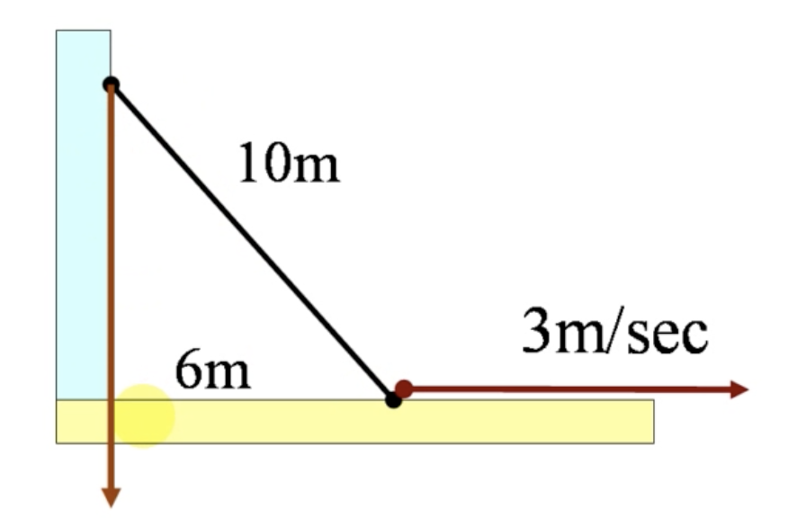

#  导数与微分

## 一.导数

### (一).定义

函数 $y=f(x)$ ，在点 $x_{0}$ 某个领域内有定义
$$
x_{0}\rightarrow x_{0} + \Delta x \\
y_{0}\rightarrow y_{0} + \Delta y\\
\Delta y=f(x_{0}+\Delta x) - f(x_{0})
$$
若极限 $\displaystyle\lim_{\Delta x\rightarrow 0}\frac{\Delta y}{\Delta x}=\lim_{\Delta x\rightarrow 0}\frac{f(x_{0}+\Delta x)-f(x_{0})}{\Delta x}$ 存在，则称函数 $f(x)$ 在点 $x_{0}$ 处可导。

该极限称为函数在点 $x_{0}$ 处的导数，记为
$$
\begin{align}
{f}'(x_{0})&=\lim_{x\rightarrow x_{0}}\frac{f(x)-f(x_{0})}{x-x_{0}}
\end{align}
$$

> 左导数：$\displaystyle f_{-}'(x_{0})=\lim_{x\rightarrow x_{0}^{-}}\frac{f(x)-f(x_{0})}{x-x_{0}}$
>
> 右导数：$\displaystyle f_{+}'(x_{0})=\lim_{x\rightarrow x_{0}^{+}}\frac{f(x)-f(x_{0})}{x-x_{0}}$
>
> $f'(x)\,存在\Leftrightarrow f_{-}'(x_{0})=f_{+}’(x_{0})$

若极限不存在，则称函数 $f(x)$ 在点 $x_{0}$ 处不可导。

#### 1.几何解释

#####  1.1 切线

* 曲线上每一点处都有切线，导数是切线的斜率。

* 曲线 $y=f(x)$ 在点 $P(x_{0},f(x_{0}))$ 处的切线方程 $y$ 为：

$$
y-f(x_{0}) = f'(x_{0})(x-x_{0})
$$

##### 1.2 法线

* 法线的斜率：

$$
k_{法} = -\frac{1}{k_{切}}
$$

* 法线方程 $y$ 为：
  $$
  y-f(x_{0}) = -\frac{1}{f'(x_{0})}(x-x_{0})\,\,\,\,\,\,(f'(x_{0})\neq 0)
  $$
  

> 当 $f'(x_{0}) = 0$  时，
>
> 切线方程： $y=f(x_{0})$ （水平）
>
> 法线方程：$x=x_{0}$ （铅直）

>当 $f'(x_{0})=\infty$ 时，
>
>切线方程：$x=x_{0}$ （铅直）
>
>法线方程：$y=f(x_{0})$（水平）

#### 2.导数的记号

导数符号：
$$
\begin{align}
&y=f(x)\\
{f}'(x)\,\,\,\,\,\,\,\,&{y}'\,\,\,\,\,\,\,\,\frac{dy}{dx}=\lim_{\Delta x\rightarrow 0}\frac{\Delta y}{\Delta x}
\end{align}
$$
某一点 $x_{0}$ 处的导数符号：
$$
{f}'(x_{0})\,\,\,\,\,\,\,\,{y}'(x_{0})\,\,\,\,\,\,\,\,\frac{dy}{dx}|_{x=x_{0}}
$$

> 导数是一种特定的极限形式

#### 3. 可导与连续性的关系

若函数在一点可导，则它在该点一定连续；

若函数不连续，则一定不可导；

若函数连续，则不一定可导。

> 函数 $y = f(x)$  在点 $x_{0}$ 处可导 $\displaystyle\Leftrightarrow \lim_{\Delta x\rightarrow0}\frac{\Delta y}{\Delta x}$ 极限存在

> 函数 $y = f(x)$  在点 $x_{0}$ 处连续 $\displaystyle\Leftrightarrow \lim_{\Delta x\rightarrow0}\Delta y=0$ 

#### 4.常用公式                                                      

当 ${f}'(x_0)$ 存在：
$$
\begin{align}
\lim_{\Delta x\rightarrow0}\frac{f(x_{0}+{\color{red}a}\Delta x)}{\Delta x} &=a{f}'(x_{0})\\
\lim_{\Delta x\rightarrow 0}\frac{f(x_{0}+ {\color{red}a}\Delta x)-f(x_{0}-{\color{blue}b}\Delta x)}{\Delta x}&=({\color{red}a}+{\color{blue}b}){f}'(x_{0})\\\\\\
{(C)}' &=0（C 是常数）\\\\\\
(x^{\mu})' &=\mu x^{\mu-1}\,\,\,（\mu\in R）\\
(\sqrt{x})'&=\frac{1}{2\sqrt{x}}\\
(\frac{1}{x})'&=-\frac{1}{x^{2}}\\\\\\
(sinx)'&=cosx\\
(cosx)'&=-sinx\\
(tanx)'&=sec^{2}x=\frac{1}{cos^{2}x}\\
(cotx)'&=-csc^{2}x=-\frac{1}{sin^{2}x}\\
(secx)'&=secx\cdot tanx\\
(cscx)'&=-cscx\cdot cotx\\
(arcsinx)'&=\frac{1}{\sqrt{1-x^{2}}}\\
(arccosx)'&=-\frac{1}{\sqrt{1-x^{2}}}\\
(arctanx)'&=\frac{1}{1+x^{2}}\\
(arccotx)'&=-\frac{1}{1+x^{2}}\\
(arcsecx)' &=\frac{1}{x\sqrt{x^{2}-1}}\,\,\,\,(|x|>1)\\
(arccscx)' &=-\frac{1}{x\sqrt{x^{2}-1}}\,\,\,\,(|x|>1)\\
(shx)' &=chx\\
(chx)' &=shx\\
(thx)' &=\frac{1}{(chx)^{2}}\\
(arcshx)' &=\frac{1}{\sqrt{x^{2}+1}}\\
\\
（a>0\,且\,a\neq0）：\\
(a^{x})'&=a^{x}\ln a\\
(e^{x})'&=e^{x}\\
(\log_{a}x)'&=\frac{1}{x\ln a}\\
(\ln x)'&=\frac{1}{x}\\
(\ln |x| )'&=\frac{1}{x}\\
[\ln(x+\sqrt{x^{2}+a^{2}})]'&=\frac{1}{\sqrt{x^{2}+a^{2}}}\\
\\
\\
(u^{v})'&=u^{v}(v'\ln u+\frac{vu'}{u})\\

\end{align}\\
$$

#### 5.导数的四则运算

##### 5.1 基本法则

设函数 $u(x)$ 和 $v(x)$ 在点 $x$ 处可导，则：
$$
\begin{align}
[u\pm v]' &= u'\pm v' \\\\
[uv]' &= u'v + uv'\\\\
[\frac{u}{v}]' &=\frac{u'v-uv'}{v^{2}} \,\,\,\,(v(x)\neq 0)\\\\
[\frac{1}{v}]'&=-\frac{v'}{v^{2}}\\\\\\
(\sum_{i=1}^{n}u_{i})'&=\sum_{i=1}^{n}u_{i}'\\
即：(u_{1}+u_{2}+...+u_{n})' &= u_{1}'+u_{2}'+...+u_{n}'\\\\\\
(\prod_{i=1}^{n}u_{i})'&=\sum^{n}_{i=1}u_{1}...u'_{i}...u_{n}\\
即：(u_{1}u_{2}...u_{n})' &= u_{1}'u_{2}...u_{n} + u_{1}u_{2}'...u_{n}+...+u_{1}u_{2}...u_{n}'\\\\\\
[C\cdot u]'&=C\cdot u' \,\,\,\,\,(C 是常数)\\\\
(\sum_{i=1}^{n}C_{i}u_{i})'&=\sum_{i=1}^{n}C_{i}u_{i}'\\
即：(C_{1}u_{1}+C_{2}u_{2}+...+C_{n}u_{n})'&=C_{1}u_{1}'+C_{2}u_{2}'+...+C_{n}u_{n}'\\
\end{align}
$$

> 注意：
>
> $\frac{u'}{v'}\neq(\frac{u}{v})'$

##### 5.2 反函数的求导法则

若 $y=f^{-1}(x)$ 为 ${\color{red}x}=f({\color{blue}y})$ 的反函数，则
$$
\begin{align}
y'=[f^{-1}({\color{red}x})]'=\frac{1}{f'({\color{blue}y})}
\end{align}
$$

##### 5.3 复合函数的求导法则（链式法则 The Chain Rule）

设函数 $u=g(x)$ 在点 $x$ 处可导，而函数 $y=f(u)$ 在点 $u=g(x)$ 可导，则复合函数 $y=f[g(x)]$  在点 $x$ 处可导，且有导数：
$$
\frac{dy}{dx}=\frac{dy}{du}\frac{du}{dx}=f'(u)\cdot g'(x)
$$

> 注意：
>
> $[f(\varphi(x))]'\neq f'(\varphi(x))$
>
> $[f(\varphi(x))]'=f'(\varphi(x))\cdot\varphi'(x)$
>
> $f'(\varphi(x))\cdot\varphi'(x)$ 不是复合函数

 

##### 5.4 奇（偶）函数的导数

奇函数的导数是偶函数，偶函数的导数是奇函数。

##### 5.5 周期函数的导数

周期函数的导数仍然是周期函数，且周期相同。

##### 5.6 分段函数的导数

分段点处一般使用定义求导，满足特殊条件时可采用公式求导：
$$
\begin{align}
&f(x)=
\left\{\begin{matrix}
 & g(x), x<x_{0}\\
 & f(x_{0}),x=x_{0}\\
 & h(x),x>x_{0}
\end{matrix}\right.
\\
\\
\\
&若\,\,f(x)\,\,在\,\,x=x_{0} \,\,处连续:\\
&\lim_{x\rightarrow x_{0}^{-}}g(x)= \lim_{x\rightarrow x_{0}^{+}}h(x)=f(x_{0})
\\
\\
&则:\\
&f_{-}'(x_{0})=\lim_{x\rightarrow x_{0}^{-}}g'(x)\\
&f_{+}'(x_{0})=\lim_{x\rightarrow x_{0}^{-}}h'(x)\\
\end{align}
$$

* 单侧导数：

  设函数 $f(x)$ 再 $(a, x_{0}]$ 上连续，再 $(a,x_{0})$ 内可导，且极限 $\displaystyle\lim_{x\rightarrow x_{0}^{-}}f'(x)$ 存在，则左导数 $f_{-}'(x_{0})$ 存在，且 $\displaystyle f_{-}'(x_{0})=\lim_{x\rightarrow x_{0}^{-}} f'(x)$

注意：没有函数的连续性，用公式求分段点的导数可能导致严重的错误

##### 5.7 隐函数的导数

隐函数 （implicit functions）：由隐式方程所隐含定义的函数。
$$
F(x,y)=0\,\,\rightarrow\,\, y=y(x)
$$
如： $x^{2}+y^{2} = 1$ ， $x^{3}+y^{3}=6xy$

 隐函数只是表示函数的一种方式，隐函数远远多于显函数，因为每一个显函数都可以写成隐函数，但是隐函数不一定能写成显函数。

* 隐函数的求导方法：方程 $f(x,y)=0$ 两端对自变量 $x$ 求导，将式子中的 y 视为函数 y(x) （凡是 $y$ 的函数都要视为 $x$ 的复合函数）然后解出导数 $\frac{dy}{dx}$ 即可。

  例如:
  $$
  设方程\,\,\,\, x^{2}+y^{2}=1 \,\,\,确定了函数\,\,\,y=y(x)\,\,\,,求导数\,\,\, \frac{dy}{dx}。\\
  (x^{2}+y^{2})'=(1)'\\
  (x^{2})'+(y^{2})'=0\\
  2x+2y\cdot y'=0\\
  y'=-\frac{x}{y}
  $$
  

##### 5.8 由参数方程确定的函数的导数

（1）由参数方程确定的曲线：
$$
\left\{\begin{matrix}
x=\varphi(t)\\
y=\psi(t)
\end{matrix}\right.
\Rightarrow(x,y)=(\varphi(t),\psi(t))
$$
$t$ 是参数

当 $t$ 变动时，点 $(x,y)=(\varphi(t),\psi(t))$ 描绘出曲线 $\tau$ (运动轨迹)。

（2）由参数方程确定的函数:
$$
\begin{align}
&\left\{\begin{matrix}
x=\varphi(t)\\
y=\psi(t)
\end{matrix}\right.
\Rightarrow y=y(x)
\\\\
x=\varphi(t)&\Rightarrow t=\varphi^{-1}(x)\\\\
&\Rightarrow y=\psi(t)=\psi[\varphi^{-1}(x)]=y(x)
\end{align}
$$
不管能否由 $x=\varphi(t)$ 解出 t，参数方程在一定条件下确定了一个函数 $y=y(x)$（可能是局部的，而不是整体的）。

参数方程是表示函数的又一种方式，参数方程给我们提供了描绘曲线的便利，每一个显函数都可以写成参数方程的形式。

（3）由参数方程确定的函数的导数

使用链式法则和反函数的求导法则

将参数 $t$ 视为中间变量：
$$
\frac{dy}{dx}=\frac{dy}{dt}\cdot\frac{dt}{dx}=\frac{dy}{dt}\cdot\frac{1}{\frac{dx}{dt}}=\frac{\frac{dy}{dt}}{\frac{dx}{dt}}=\frac{\psi'(t)}{\varphi'(t)}=\frac{y'(t)}{x'(t)}
$$

（4）参数方程的切线和法线

曲线在点 $M(x_{0},y_{0})$ 处的

* 切线斜率 $k_{切}=\frac{y'(t_{0})}{x'(t_{0})}$，

切线方程：

$y-y_{0}=\frac{y'(t_{0})}{x'(t_{0})}(x-x_{0})$，记为 $\frac{x-x_{0}}{x'(t_{0})}=\frac{y-y_{0}}{y'(t_{0})}$ （对称式）；

* 法线斜率 $k_{法}=-\frac{x'(t_{0})}{y'(t_{0})}$

法线方程：

$y-y_{0}=-\frac{x'(t_{0})}{y'(t_{0})}(x-x_{0})$，记为 $x'(t_{0})(x-x_{0})+y'(t_{0})(y-y_{0})=0$（点法式）

* 切向量： $\tau=(x'(t_{0}),y'(t_{0}))$
* 法向量：$\eta=(-y'(t_{0}),x'(t_{0}))$

（5）一些参数方程的题涉及到的知识点

位矢：$r(t)=\{x(t),y(t\}$ 

速度：$v(t)=\frac{dr}{dt}=\{x'(t),y'(t)\}$

加速度：$a(t)=\frac{dv}{dt}=\frac{d^{2}r}{dt^{2}}=\{x''(t),y''(t)\}$

速率：$u(t)=|v(t)|=\sqrt{[x'(t)]^{2} + [y'(t)]^{2}}$

##### 5.9多项式函数的导数

多项式函数在整个实数域内连续可导。

#### 6.相关变化率

设变量 $x$  和 $y$ 由一个方程 $F(x,y)=0$ 联系着， $x$ 和 $y$ 都是时间 $t$ 的可导函数：$x=x(t),y=y(t)$。

利用链式法则将方程 $F[x(t),y(t)]=0$ 关于时间 $t$ 求导，可得变化率 $\frac{dx}{dt}$ 和 $\frac{dy}{dt}$ 之间的一个等式。

如果已知其中一个变化率，由此等式可求出与之相关的另一个变化率，这就是所谓的相关变化率（related rates）问题。

解决相关变化率问题，首先要建立这两个相关变量的一个等式，然后对时间求导，找到相关变化率的关系。

> 例如：滑梯模型
>
> 一个长度为 10 米的梯子斜靠在纯质的墙上。若梯子下端以 3 m/s 的速度离开墙壁，问当梯子下端距离墙壁 6 米时，梯子上端向下滑动的速度是多少？
>
> 
>
> 解 设梯子下端距离墙壁 $x$ 米，上端距离地面 $h$ 米，$x$ 和 $h$ 均为时间的函数。已知 $\frac{dx}{dt}=3$（米/秒），欲求 $x=6$ （米）时的 $\frac{dh}{dt}$ 值。
>
> 由勾股定理：
>
> $x^{2}+h^{2}=10^{2}$
>
> 等式两边对时间 $t$ 求导： 
> $$
> \begin{align}
> (x^{2}+h^{2})_{t}'&=(10^{2})_{t}'\\
> 2x\frac{dx}{dt}+2h\frac{dh}{dt}&=0\\
> \frac{dh}{dt}&=-\frac{x}{h}\cdot\frac{dx}{dt}\\
> 
> 将\frac{dx}{dt}=3,&x=6,h=8\,代入，得\\
> \frac{dh}{dt}&=-\frac{9}{4}（米/秒）
> 
> \end{align}
> $$
> 

### (二).高阶导数

#### 1.表示方式

$y^{(n)}$ 										$f^{(n)}(x)$	 							$\frac{d^{n}y}{dx^{n}}$
$$
\frac{d^{n}y}{dx^{n}} = \frac{d}{dx}(\frac{d^{n-1}y}{dx^{n-1}})
$$

#### 2.常用公式

$$
\begin{align}

(x^{n})^{(n)}&=n!\\
\\
(a^{x})^{(n)}&=(\ln a)^{n}a^{x}\\
(a^{kx})^{(n)}&=(k\ln a)^{n}a^{kx}\\
(e^{x})^{(n)}&=e^{x}\\
(xe^{x})^{(n)}&=e^{x}(x+n)\\
\\
(sinx)^{(n)}&=sin(x+n\cdot\frac{\pi}{2})\\
(cosx)^{(n)}&=cos(x+n\cdot\frac{\pi}{2})\\
[sin(ax+b)]^{(n)}&=sin(ax+b+n\cdot\frac{\pi}{2})\cdot a^{n}\\
[cos(ax+b)]^{(n)}&=cos(ax+b+n\cdot\frac{\pi}{2})\cdot a^{n}\\
\\
(\frac{1}{ax+b})^{(n)}&=(-1)^{n}\frac{a^{n}n!}{(ax+b)^{n+1}}\\
(\frac{1}{x+1})^{(n)}&=(-1)^{n}\frac{n!}{(x+1)^{n+1}}\\
(\frac{a}{x+1})^{(n)}&=(-1)^{n}\frac{n!}{(x+1)^{n+1}}\cdot a\\
(\frac{1}{x})^{(n)}&=(-1)^{n}\frac{n!}{x^{n+1}}\\
[\ln(1+x)]^{(n)}&=(-1)^{n-1}\frac{(n-1)!}{(x+1)^{n}}
\end{align}
$$

#### 3.高阶导数的运算法则

$$
\begin{align}
(u\pm v)^{(n)}&=u^{(n)}\pm v^{(n)}\\
(C\cdot u)^{(n)}&=C\cdot u^{(n)}\\
\\
莱布尼茨公式:(uv)^{(n)}&=\sum^{n}_{k=0}\frac{n(n-1)...(n-k+1)}{k!}u^{(n-k)}v^{(k)}\\
* 类比二项展开式: (u+v)^{n}&=\sum^{n}_{k=0}\frac{n(n-1)...(n-k+1)}{k!}u^{n-k}v^{k}

\end{align}
$$

##### 3.1 分段导数的高阶导数

函数 $f(x)=(x-a)^{n}|x-a|$ 在 $x=a$ 处有 1~n 阶导数，且 $f^{(k)}(a)=0\,\,\,\,(k=1,2,...,n)$，但 n+1 阶导数 $f^{(n+1)}(a)$ 不存在。

##### 3.2 反函数的高阶导数

$$
\begin{align}
\frac{dx}{dy} &=\frac{1}{y'}\\
\frac{d^{2}x}{dy^{2}}&=\frac{d}{d{\color{red}x}}(\frac{1}{y'})\cdot\frac{d{\color{red}x}}{dy}=\frac{(\frac{1}{y'})_{x}'}{y'}=-\frac{y''}{(y')^{3}}\\
\frac{d^{3}x}{dy^{3}}&=\frac{d}{d{\color{red}x}}(-\frac{y''}{(y')^{3}})\cdot\frac{d{\color{red}x}}{dy}=\frac{(-\frac{y''}{(y')^{3}})_{x}'}{y'}=\frac{3(y'')^{2}-y'y'''}{(y')^{5}}
\end{align}
$$
上一阶导数对 $x$ 求导，再除以 $y'$  就是反函数的下一阶导数。

##### 3.3 隐函数的高阶导数

先求一阶导数，一阶导数是一个有 x、y 构成的等式，然后在对一阶导数等式求导，得出二阶导数，二阶导数等式 x、y、y'，将之前得到的一阶导数等式带入二阶导数，等到最终由 x、y 构成的二阶导数等式，以此类推。

##### 3.4 参数方程确定函数的高阶导数

* 二阶导数：

$$
\begin{align}
\frac{d^{2}y}{dx^{2}}=\frac{d}{dx}(\frac{dy}{dx})&=\frac{d}{dt}(\frac{dy}{dx})\cdot\frac{dt}{dx}
\\\\
&=\frac{\frac{d}{dt}(\frac{{\color{blue}dy}}{{\color{blue}dx}})}{\frac{d{\color{red}x}}{dt}}
\\\\
&=\frac{[\frac{{\color{blue}\psi'(t)}}{{\color{blue}\varphi'(t)}}]'_{t}}{{\color{red}\varphi'(t)}}
\\\\
&=\frac{[\frac{{\color{blue}y'}}{{\color{blue}x'}}]'}{{\color{red}x'}}
\\\\
&=\frac{\psi''(t)\varphi'(t)-\psi'(t)\varphi''(t)}{[\varphi'(t)]^{3}}
\\\\
&=\frac{y''x'-y'x''}{(x')^{3}}
\\\\
可以使用行列式记忆法：
\frac{\begin{vmatrix}
&x'(t) &y'(t)\\
&x''(t) &y''(t)\\
\end{vmatrix}}{(x'(t))^{3}}
\end{align}
$$

将一阶导数对 t 求导，再除以 x 对 t 的导数。

* 三阶导数：

  做法类似
  $$
  \frac{d^{3}y}{dx^{3}}=\frac{[\frac{d^{2}y}{dx^{2}}]_{t}'}{x'(t)}
  $$
  将二阶阶导数对 t 求导，再除以 x 对 t 的导数。

* 综上所述，参数方程确定的函数的高阶导数求导方法：

  上一阶导数对 t 求导，再除以 $x'(t)$ 就是下一阶导数。

> 一般来说，习题里面对参数方程求导不会超过三阶。

### (三).求导技巧

##### 1. 对数求导法

（1）幂指函数
$$
\begin{align}
& y = u(x)^{v(x)}\\
取对数：&\ln y=\ln u^{v}\\
求导数：&\frac{1}{y}y'=v'\ln u+v\cdot\frac{1}{u}\cdot u'\\
得出\,：&y'=u^{v}(v'\ln u +\frac{vu'}{u})
\end{align}
$$

（2）含较多乘积因子的函数的导数
$$
\begin{align}
& y = \sqrt[3]{\frac{(x-1)(x-2)^{2}}{x-4}}\\\\
取对数：\ln y&=\ln \sqrt[3]{\frac{(x-1)(x-2)^{2}}{x-4}}\\\\
&=\frac{1}{3}\ln\frac{(x-1)(x-2)^{2}}{x-4}
\\
&=\frac{1}{3}[\ln(x-1)+2ln(x-2)-\ln(x-4)]
\\\\
求导数：&\frac{1}{y}y'=\frac{1}{3}(\frac{1}{x-1}+\frac{2}{x-2}-\frac{1}{x-4})
\\\\
得出\,：&y'=\frac{1}{3}\sqrt[3]{\frac{(x-1)(x-2)^{2}}{x-4}}(\frac{1}{x-1}+\frac{2}{x-2}-\frac{1}{x-4})
\end{align}
$$

> 这种题的结果总是一大堆，一般来说，可以不用再同分化简整理

##### 2. 指数求导法

（1）幂指函数
$$
\begin{align}
(u^{v})'&=(e^{v\ln u})'\\
&= e^{v\ln u}(v\ln u)'\\
&=u^{v}(v'\ln u+\frac{vu'}{u})
\end{align}
$$

（2）含较多乘积因子的函数的导数

​		同理对数求导法

## 二.微分（differential）

### (一).定义

设在 一点 $x$ 处，$\Delta y=f(x+\Delta x)-f(x)$ ，

如果 $\Delta y = {\color{red} A\color{red} \Delta \color{red}x}+{\color{blue}o\color{blue}(\color{blue}\Delta \color{blue}x\color{blue})}$

其中 $A$ 是只与 $x$ 有关，而与 $\Delta x$ 无关的常数，${\color{blue}o\color{blue}(\color{blue}\Delta \color{blue}x\color{blue})}$ 是 $\Delta x$ 的高阶无穷小，则称函数 $f(x)$ 在点 $x$ 处可微（differentiable) 。

并将线性主部 ${\color{red}A\color{red}\Delta \color{red}x}$ 称为函数在点 $x$ 处对应于 $\Delta x$ 的微分（differential），记做 $dy$：
$$
\begin{align}
dy&={\color{red}A\color{red}\Delta \color{red}x}\\
\\

dy&=f'(x)dx\\
\end{align}
$$

#### 1. 可微、可导、连续和有极限的关系

函数在一点可微 $\Leftrightarrow$ 函数在该点可导，且 $dy=f'(x)\Delta x$ ，即 $A=f'(x)$。

导数就是微分之商： 微商

#### 2.几何意义

* 函数的局部线性化

  由于 $dy\approx \Delta y$，用局部用切线代替曲线，也称为函数的线性近似。

  线性近似公式：$f(x)\approx f(x_{0})+f'(x_{0})(x-x_{0})$

  特殊情况，$x_{0}=0$ 时：$f(x)\approx f(0)+f'(0)x$，$|x|$  趋于 0。

  > 
  >
  > 例如：
  >
  > $f(x)=sinx\,\, sinx\approx sin0 +cos0\cdot 0$
  >
  > $sinx\approx x$，$x$ 用弧度来表示

* $\Delta y$ 和 $dy$ 的比较

  

### (二).运算法则

每一个导数公式，都对应着一个微分公式：
$$
y'=f'(x)\Rightarrow dy=f'(x)dx
$$

#### 1.基本初等函数的微分公式和运算法则

| 导数公式                               | 微分公式                                   |
| -------------------------------------- | ------------------------------------------ |
| $(x^{\mu})'=\mu x^{\mu -1}$            | $d(x^{\mu})=\mu x^{\mu -1}\,dx$            |
| $(sinx)'= cosx$                        | $d(sinx)=cosx\,dx$                         |
| $(cosx)'=-sinx$                        | $d(cosx)=-sinx\,dx$                        |
| $(tanx)'=sec^{2}x$                     | $d(tanx)=sec^{2}x\,dx$                     |
| $(cotx)'=-csc^{2}x$                    | $d(cotx)=-csc^{2}x\,dx$                    |
| $(secx)'=secx\,tanx$                   | $d(secx)=secx\,tanx\,dx$                   |
| $(cscx)'=-cscx\,cotx$                  | $d(cscx)=-cscx\,cotx\,dx$                  |
| $(a^{x})'=a^{x}\ln a$                  | $d(a^{x})=a^{x}\ln a\,dx$                  |
| $(e^{x})'=e^{x}$                       | $d(e^{x})=e^{x}dx$                         |
| $(\log_{a}x)'=\frac{1}{x\ln a}$        | $d(\log_{a}x)=\frac{1}{x\ln a}\,dx$        |
| $(lnx)'=\frac{1}{x}$                   | $d(\ln x)=\frac{1}{x}\,dx$                 |
| $(arcsinx)'=\frac{1}{\sqrt{1-x^{2}}}$  | $d(arcsinx)=\frac{1}{\sqrt{1-x^{2}}}\,dx$  |
| $(arccosx)'=-\frac{1}{\sqrt{1-x^{2}}}$ | $d(arccosx)=-\frac{1}{\sqrt{1-x^{2}}}\,dx$ |
| $(arctanx)'=\frac{1}{1+x^{2}}$         | $d(arctanx)=\frac{1}{1+x^{2}}\,dx$         |
| $(arccotx)'=-\frac{1}{1+x^{2}}$        | $d(arccotx)=-\frac{1}{1+x^{2}}\,dx$        |

|      | 求导法则                                             | 微分法则                                             |
| ---- | ---------------------------------------------------- | ---------------------------------------------------- |
| 和   | $(u\pm v)'=u'\pm v'$                                 | $d(u\pm v)=du+dv$                                    |
| 差   | $(C\,u)'=C\cdot u'$                                  | $d(C\,u)=C\cdot du$                                  |
| 积   | $(uv)'=u'v+uv'$                                      | $d(uv)=vdu+udv$                                      |
| 商   | $(\frac{u}{v})'=\frac{u'v-uv'}{v^{2}}\,\,\,(v\neq0)$ | $d(\frac{u}{v})=\frac{vdu-udv}{v^{2}}\,\,\,(v\neq0)$ |

#### 2. 复合函数微分法则

复核函数的微分：微分形式不变性

$$
\begin{align}
& y=f(u)\,\,\,\,u=g(x)\Rightarrow y=f[g(x)]\\
\\
& \frac{dy}{dx}=f'(u)u'\\
\\
&\because u'dx=du\\
\\
&\therefore dy=f'(u)u'=f'(u)du

\end{align}
$$
从我曾向内层逐层微分，直到 $dx$ 出现为止。

#### 3.隐函数的微分

用微分法求隐函数的导数是一种好方法。

隐函数求微分时，我们不必考虑谁是自变量，谁是因变量（x，y 地位平等）。

而求导数时，我们必须将 $x$ 视为自变量，$y$ 视为因变量（x，y 地位不平等）。

> 例：
> $$
> \begin{align}
> x&=\ln y \\
> \\
> \textbf{微分}：\\
> dx&=d(\ln y)\\
> &=\frac{1}{y}dy\\
> \therefore dy&=y\cdot dx\\
> \\
> \textbf{求导}：\\
> (x)'&=(\ln y)'\\
> 1&=\frac{1}{y}\cdot y'\\
> \therefore y'&=y
> 
> \end{align}
> $$

#### 4.凑微分

已知一个微分，求问是哪一个函数的微分，凑微分是不定积分的基本功。

### * 选学：

#### ①.经济学中的常用函数

##### 1.需求函数

某商品的需求量是指在一定的价格水平上，在一定的时间内，消费者愿意而且有能力购买的商品量。

忽略其他次要因素，我们可以认为商品的需求量 $Q_{d}$ 是由商品价格 $P$ 决定的，因此需求量是价格的函数：
$$
Q_{d}=Q_{d}(P)
$$
称为需求函数（也叫需求价格函数）。

一般地，需求商品价格上涨会使需求量减少，因此需求函数一般是价格 $P$  的单调减函数。

* 价格函数

需求函数的反函数也称为需求函数。(需求决定价格，所以也称为价格函数)

* 饱和需求量

  当价格 P = 0 时，此时的需求量称为饱和需求量。

##### 2.供给函数

某商品的供给量是指在一定的价格水平上，在一定的时间内，生产者愿意生产并可提供出售的商品量。

忽略其他次要因素，我们可以认为水上漂的供给量 $Q_{s}$ 是由商品价格 $P$ 决定的，因此供给量是价格的函数：
$$
Q_{s} = Q_{s}(P)
$$
称为供给函数。

一般地，商品的价格上涨，生产者就更愿意生产并向时长提供更多的商品，

因此供给函数一般是几个 $P$ 的单调增函数。

* 均衡价格、均衡数量

  当供给量和需求量相等 $Q_{d}=Q_{s}$ 时，所得的 $P$ 称为商品的均衡价格，此时的供给量和需求量称为均衡数量。

  寻求君合价格是金融经济学的主要问题之一。

##### 3.总成本函数、总收益函数、总利润函数。

总成本是指生产一定数量的产品所需要的总投入。

 总收益是出售一定数量的产品所得到的全部收入。

总利润是总收益减去总成本后的余额。

若产品价格为 $P$，销售量为 $Q$

总成本、总收益和总利润都与产品的产量或销量 $Q$ 有关，因此它们都是 $Q$ 的函数。

总成本函数：$C=C(Q)$

总收益函数：$R=R(Q)=QP$(Q)

总利润函数：$L=L(Q)=R(Q)-C(Q)$

平均成本：$\bar{C}=\frac{C(Q)}{Q}$

平均收益：$\bar{R}=\frac{R(Q)}{Q}=P$

平均利润：$\bar{L}=\frac{L(Q)}{Q}$

通常，总成本由固定成本（不变成本） $C_{0}$ 与可变成本 $C_{1}$ 两部分构成。

固定成本是指支付固定生产要素的费用，如建厂房、购置设备等费用，它与产量 $Q$ 无关。

可变成本是指支付可变生产要素的费用，如购买原材料、燃料、支付工资等费用，它随产量 $Q$ 而变动。

于是有 $C(Q)=C_{0}+C_{1}(Q)$

总成本 $C(Q)$ 是产量 $Q$ 的单调增函数。

#### ②.边际

一般地，设 $y=f(x)$ 是某一经济函数（如成本、收益、利润等等），且 $f(x)$ 可导，则成函数 $f'(x)$ 为 $f(x)$ 的边际函数。

$f'(x_{0})$ 表示：当 $x=x_{0}$ 时，$x$ 改变一个单位时，$y$ 会大约改变 $f'(x_{0})$ 个单位。（通常省去"大约"二字）

简而言之，边际函数就是导数。

函数的边际（导数，变化率）反映的是自变量改变 1 个单位时，因变量会改变几个单位（改变边际个单位）。

##### 1.边际成本（Marginal cost）

总成本函数 $C(Q)$ 对产量 $Q$ 的导数 $C'(Q)$称为 边际成本，记为 $MC$，即

$$
MC=C'(Q)=\frac{dC}{dQ}
$$

表示已经生产了 $Q$ 件产品，再多生产（或减少生产）一件产品的所增加（或减少）成本。

##### 2.边际收益（Marginal Revenue）

总收益函数 $R(Q)$ 对销量 $Q$ 的导数 $R'(Q)$ 称为边际收益，记为 $MR$ ，即
$$
MR=R'(Q)=\frac{dR}{dQ}=[QP(Q)]'=P(Q)+QP'(Q)
$$
它是总收益关于销量 $Q$ 的变化率，它（近似地）表示：假定已经销售了 $Q$ 件商品，再销售一件商品所增加的收益。

##### 3.边际利润（Marginal profit）

总利润函数 $L(Q)$ 对销量 $Q$ 的导数 $L'(Q)$ 称为边际利润，记为 $ML$ ，即
$$
ML = L'(Q)=\frac{dL}{dQ}
$$
它是总利润关于销量 $Q$ 的变化率，它（近似地）表示：假定已经销售了 $Q$ 件商品，再销售一件商品所增加的利润。

#### ③.弹性（Elasticity）

##### 1.定义

如果说边际是函数的变化率，那么弹性则是函数的相对变化率。

设函数 $y=f(x)$ 在点 $x=x_{0}$ 处可导，函数的相对改变量 $\frac{\Delta y}{y_{0}}=\frac{f(x_{0}+\Delta x)-f(x_{0})}{y_{0}}\,\,\,\,(y_{0}=f(x_{0}))$ 与自变量的相对改变量 $\frac{\Delta x}{x_{0}}$ 之比 $\frac{\frac{\Delta y}{y_{0}}}{\frac{\Delta x}{x_{0}}}$ 称为函数 $f(x)$ 从 $x_{0}$ 到 $x_{0}+ \Delta x$ 两点间的平均相对变化率。也称为两点间的弹性。

当 $\Delta x\rightarrow0$ 时， $\frac{\frac{\Delta y}{y_{0}}}{\frac{\Delta x}{x_{0}}}$ 的极限称为函数 $y=f(x)$ 在点 $x=x_{0}$ 处的相对变化率或弹性（Elasticity），记作 $\frac{Ey}{Ex}|_{x=x_{0}}$ 或 $\frac{E}{Ex}f(x_{0})$
$$
\frac{Ey}{Ex}|_{x=x_{0}}=\lim_{\Delta x\rightarrow0}\frac{\frac{\Delta y}{y_{0}}}{\frac{\Delta x}{x_{0}}}=\lim_{\Delta x\rightarrow0}\frac{\Delta y}{\Delta x}\frac{x_{0}}{y_{0}}=f'(x_{0})\frac{x_{0}}{f(x_{0})}
$$

可导函数 $y=f(x)$ 在 $x$ 处的弹性
$$
\frac{Ey}{Ex}=y'\frac{x}{y}=\frac{dy}{dx}\frac{x}{y}
$$
称为 $y=f(x)$ 的弹性函数。

反映了随着 $x$ 的变化，$f(x)$ 的变化幅度的大小，他反应了 $f(x)$ 对 $x$ 的变化的反应的强烈程度或灵敏度。

具体的说， $\frac{E}{Ex}f(x_{0})$ 表示在点 $x=x_{0}$ 处，当自变量 $x$ 产生 1% 的改变时，函数 $y=f(x)$ 会（近似地）改变 $\frac{E}{Ex}f(x_{0})\%$。

* 边际与弹性
  $$
  \frac{Ey}{Ex}=\frac{dy}{dx}\frac{x}{y}=\frac{\frac{dy}{dx}}{\frac{y}{x}}=\frac{边际函数}{平均函数}
  $$
  所以弹性函数在经济学中可以理解为边际函数与平均函数的商。
  $$
  \frac{dy}{dx}=\frac{y}{x}\frac{Ey}{Ex}
  $$
  ​											边际=平均x弹性

* 不变弹性函数

  幂函数 $y=x^{\mu}$ 的弹性函数为 $\mu$ ，即任意点处弹性不变，称为不变弹性函数。

#####  2.弹性的运算律

$$
\begin{align}
&(1)\frac{E}{Ex}[kf(x)]=\frac{Ef}{Ex}\\
\\
&(2)\frac{E}{Ex}[f(x)\pm g(x)]=\frac{f(x)\frac{Ef}{Ex}\pm g(x)\frac{Eg}{Ex}}{f(x)\pm g(x)}\\
\\
&(3)\frac{E}{Ex}[f(x)g(x)]=\frac{Ef}{Ex}+\frac{Ef}{Ex}\\
\\
&(4)\frac{E}{Ex}[\frac{f(x)}{g(x)}]=\frac{Ef}{Ex}-\frac{Eg}{Ex}\\
\\
&(5)\frac{E}{Ex}f[\varphi(x)]=\frac{Ef}{E\varphi}\cdot\frac{E\varphi}{Ex}\,\,\,\,(链式法则)
\end{align}
$$

由 (1) 可知，弹性没有线性性质：$\frac{E}{Ex}[kf(x)]\neq k\frac{E}{Ex}f(x)$

