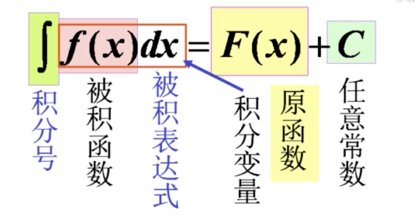
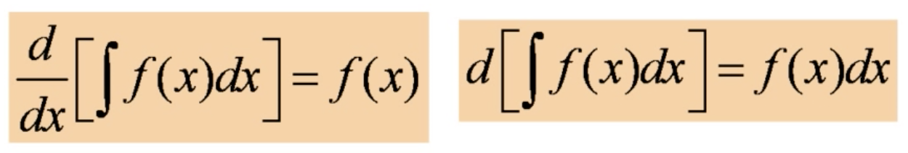
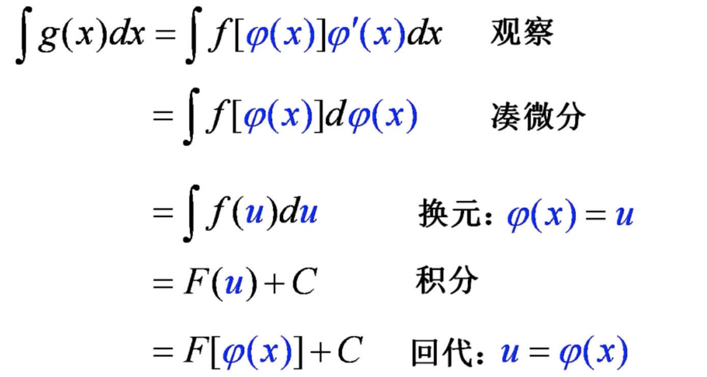
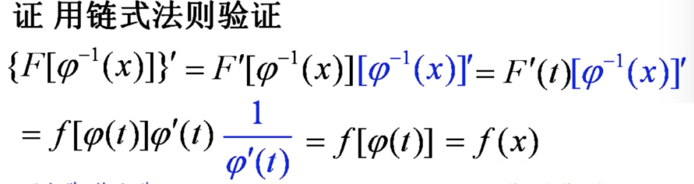
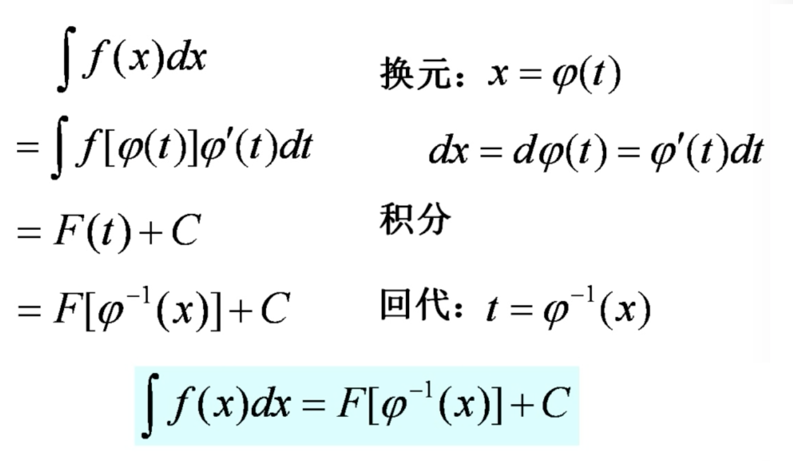

# 不定积分

## 一.不定积分的概念与性质

### 1.原函数与不定积分的概念

#### 1.1 原函数

如果区间 $I$ 上，

​				$F'(x) = f(x)$

则称 $F(x)$ 是函数 $f(x)$ 在区间 $I$ 上的一个原函数(反函数 antiderivative)

> $f(x)$ 是 $F(x)$ 的导数，$F(x)$ 就是 $f(x)$ 的一个原函数。

 原函数存在定理 ：

连续函数一定有原函数。

> 不连续的函数不一定有原函数。

原函数并不唯一。

#### 1.2 不定积分

在区间 $I$ 上，函数 $f(x)$ 的带有任意常数项的原函数，称为 $f(x)$ 在区间 $I$ 上的不定积分，记作 $\displaystyle\int f(x)dx$.

> $x$ 称为积分变量

#### 1.3 积分曲线

函数 $f(x)$ 的原函数的图形称为 $f(x)$ 的积分曲线（Integral curves）。

求不定积分得到的是积分曲线族。

### 2. 基本的积分公式

由不定积分的定义知道：

每一个导数公式都对应着一个积分公式：

​				$\displaystyle F'(x) = f(x) \Rightarrow \int f(x)dx = F(x) + C$ 

| 积分             | 结果                                         |
| ---------------- | -------------------------------------------- |
| $\displaystyle\int x^{\mu}dx$   $(\mu \neq -1)$ | $\displaystyle\frac{x^{\mu+1}}{\mu + 1} + C$ |
|$\displaystyle\int k dx$|$kx + C$|
|$\displaystyle\int \frac{1}{x^{2}}dx$|$\displaystyle -\frac{1}{x} + C$|
|$\displaystyle\int\frac{1}{\sqrt{x}}dx$|$2\sqrt{x} + C$|
|$\displaystyle\int \frac{1}{x}dx$|$\ln{|x|} + C$|
|$\displaystyle\int \frac{1}{1+x^{2}}dx$|$arctanx + C$|
|$\displaystyle\int\frac{1}{\sqrt{1-x^{2}}}dx$|$arcsinx + C$|
|$\displaystyle\int-\frac{1}{\sqrt{1-x^{2}}}dx$|$arccosx + C$|
|$\displaystyle\int cosx dx$|$sinx + C$|
|$\displaystyle\int sinxdx$|$-cosx + C$|
|$\displaystyle\int\frac{1}{cos^{2}x}dx = \int sec^{2}xdx$|$tanx + C$|
|$\displaystyle\int\frac{1}{sin^{2}x}dx=\int csc^{2}x dx$|$-cotx + C$|
|$\displaystyle\int secxtanx dx$|$secx + C$|
|$\displaystyle \int cscx cotx dx$|$-cscx + C$|
|$\displaystyle\int e^{x} dx$|$e^{x} + C$|
|$\displaystyle\int a^{x} dx$|$\displaystyle\frac{a^{x}}{\ln a} + C$|
|$\displaystyle\int shx dx$|$chx + C$|
|$\displaystyle\int chx dx$|$shx + C$|

### 3.不定积分的性质

#### 3.1 不定积分的基本性质

$\displaystyle\int F'(x)dx = F(x) + C$

$\displaystyle[\int f(x)dx]'=[F(x) + C]'=F'(x) = f(x)$

即

微分运算与不定积分的运算是互逆的。

#### 3.2 不定积分的线性性质

|      |                      不定积分的线性性质                      |
| :--: | :----------------------------------------------------------: |
| (1)  | $\displaystyle \int [f(x) \pm g(x)]dx = \int f(x)dx \pm g(x)dx$ |
|(2)|$\displaystyle \int k f(x)dx = k \int f(x)dx$   $(k \neq 0)$|

此性质可以推广到有限多个函数之和(差)的情况

> 分段函数求原函数时，需要注意分段点的连续性和可导性。
>
> 例如，符号函数在其定义域内没有原函数。
>
> 
>
> 可以证明：导函数没有第一类间断点。所以有第一类间断点 $x_{0}$ 的函数 $f(x)$ 在包含 $x_{0}$ 的区间内没有原函数。
>
> 
>
> 但是有第二类间断点的函数可能有原函数。

## 二.换元积分法

###  1.第一类换元法

 

#### 1.1 定理 1 

设 $\displaystyle \int f(u)du = F(u) + C$     	 $F'(u) = f(u)$

所以 $\displaystyle \int f[\varphi (x)] \varphi'(x) dx = F[\varphi(x)] + C = [\int f(u)du]_{u=\varphi'(x)}$ 

所以 $\varphi'(x)dx = d\varphi(x)$

#### 1.2 凑微分法的步骤

凑微分法实际上是复合函数微分的逆过程。

#### 1.3 常用的凑微分公式

| 积分                                                 | 结果                                                         |
| ---------------------------------------------------- | ------------------------------------------------------------ |
| $\displaystyle \int \frac{1}{ax+b}dx$                | $\displaystyle \frac{1}{a}\ln{|ax+b|} + C$                   |
| $\displaystyle \int\frac{1}{a^{2}+x^{2}}dx$          | $\displaystyle\frac{1}{a}arctan\frac{x}{a} + C$              |
| $\displaystyle \int\frac{1}{\sqrt{a^{2} - x^{2}}}dx$ | $\displaystyle arcsin\frac{x}{a} + C$                        |
| $\displaystyle \int\frac{1}{x^{2}-a^{2}}$            | $\displaystyle \frac{1}{2a}\ln{|\frac{x-a}{x+a}|} + C$       |
| $\displaystyle\int\frac{1}{x^{2}-a^{2}}dx$           | $\displaystyle \frac{1}{a-b}\ln{|\frac{x-a}{x-b}|} + C$     $(a\neq b)$ |
| $\displaystyle \int f(x^{n})x^{n-1}dx$               | $\displaystyle \frac{1}{n}\int f(x^{n})dx^{n}$               |
| $\displaystyle\int \frac{f(\ln{x})}{x}dx$            | $\displaystyle\int f(\ln{x})d\ln{x}$                         |
| $\displaystyle\int f(e^{x})e^{x}dx$                  | $\displaystyle\int f(e^{x})de^{x}$                           |
| $\displaystyle \int tanx dx$                         | $-\ln{|cosx|} + C$                                           |
| $\displaystyle \int f(cosx)sinx dx$                  | $\displaystyle -\int f(cosx)dcosx$                           |
| $\displaystyle\int f(sinx)cosxdx$                    | $\displaystyle\int f(sinx)dsinx$                             |
| $\displaystyle \int cotxdx$                          | $\ln{|sinx|} + C$                                            |
| $\displaystyle \int secxdx$                          | $\displaystyle\ln{|secx + tanx|} + C$                        |
| $\displaystyle \int cscxdx$                          | $\displaystyle \ln{|tan\frac{x}{2}|} + C = \ln{|cscx - cotx|} + C$ |
| $\displaystyle \int cos^{2}x$                        | $\displaystyle \frac{x}{2} + \frac{sin2x}{4} + C$            |
| $\displaystyle \int sin^{2}x dx$                     | $\displaystyle \frac{x}{2} - \frac{sin2x}{4} + C$            |
| $\displaystyle \int \frac{arctanx}{1+x^{2}}dx$       | $\displaystyle \int f(arctanx)darctanx$                      |
| $\displaystyle \int \frac{f(tanx)}{cos^{2}x}dx$      | $\displaystyle \int f(tanx)dtanx$                            |
| $\displaystyle\int \frac{f(cotx)}{sin^{2}x}dx$       | $\displaystyle - \int f(cotx)dcotx$                          |
| $\displaystyle\frac{1}{1+cosx}dx$                    | $\displaystyle dtan\frac{x}{2}$                              |
| $\displaystyle \frac{x}{\sqrt{x^{2} + a^{2}}}dx$     | $\displaystyle d\sqrt{x^{2}+a^{2}}$                          |

 

 

 

### 2.第二类换元法

#### 2.1 定理 2 （不定积分的第二类换元法）

设 $f(x)$ 在 $[a,b]$ 上连续， $x=\phi(t)$ 单调、可导，又 $F(t)$ 是 $f[\phi (t)] \phi'(t)$ 的原函数，则

​							$\displaystyle \int f(x) dx = F[\varphi^{-1}(x)] + C$

#### 2.2 第二类换元法的步骤

#### 2.3 常见的第二换元积分的类型

##### (1) 有理代换

|      |                     有理代换                      |                           解题思路                           |
| :--: | :-----------------------------------------------: | :----------------------------------------------------------: |
|  1   |    $\displaystyle \int f(\sqrt[n]{ax + b})dx$     | $ u = \sqrt[n]{ax+b} ,\\ \displaystyle x=\frac{1}{a}(u^{n} - b),\\ \displaystyle dx = \frac{n}{a}u^{n-1}du, \\ \displaystyle \int f(\sqrt[n]{ax + b})dx = \int f(u)\cdot \frac{n}{a} u^{n-1}du。$ |
|  2   |         $\sqrt[k]{x}, ..., \sqrt[l]{x} $          | $当被积函数含有两种以上的根式,\\  \sqrt[k]{x}, ..., \sqrt[l]{x} 时，\\ 可令 x = t^{n},其中 n 为各根指数的最小公倍数。$ |
|  3   | $\displaystyle \int \sqrt{\frac{ax + b}{cx + d}}$ | $\displaystyle 令 t = \sqrt{\frac{ax + b}{cx + d}}, \\ 得到 x = x(t)。$ |
|  4   |   $\displaystyle \int \sqrt{\frac{a+x}{a-x}}dx$   | $\displaystyle =\int\frac{a+x}{\sqrt{a^{2} - x^{2}}}dx \\  \displaystyle = \int\frac{a}{\sqrt{a^{2} - x^{2}}}dx + \int\frac{x}{\sqrt{a^{2} - x^{2}}}dx\\ \displaystyle = a\cdot arcsin\frac{x}{a} - \sqrt{a^{2} - x^{2}} + C$ |
|  5   |  $\displaystyle \int \frac{1}{\sqrt{1+e^{x}}}dx$  | $t=\sqrt{e^{x} + 1}, \\ x=\ln{(t^{2} - 1)}, \\ \displaystyle dx = \frac{2t}{t^{2} - 1}dt, \\ \displaystyle\int \frac{1}{\sqrt{1+e^{x}}}dx = \int\frac{2}{t^{2} - 1}dt\\ \displaystyle = \int(\frac{1}{t-1} - \frac{1}{t+1})dt \\ \displaystyle= \ln{|\frac{t-1}{t+1}|} + C $ |

​         

##### (2).三角代换

|      |                    三角代换                    |                           解题思路                           |
| :--: | :--------------------------------------------: | :----------------------------------------------------------: |
|  1   | $\displaystyle \int f(\sqrt{a^{2} - x^{2}})dx$ | $1 - sin^{2}x = cos^{2}x, \\ x = asint, \\ dx = acostdt, \\ a^{2}-(asint)^{2} =(acost)^{2}. $ |
|  2   | $\displaystyle \int f(\sqrt{x^{2} + a^{2}})dx$ | $tan^{2}x + 1 = sec^{2}x, \\ x = atant, \\ (atant)^{2} + a^{2} = (asect)^{2}.$ |
|  3   |  $\displaystyle\int (\sqrt{x^{2} - a^{2})}dx$  | $sec^{2}x - 1 = tan^{2}x, \\ x = asect, \\ (asect)^{2} - a^{2} = (atant)^{2}.$ |

​          

## 三.分部积分法

## 四.有理函数的积分

## 五.积分表的使用

