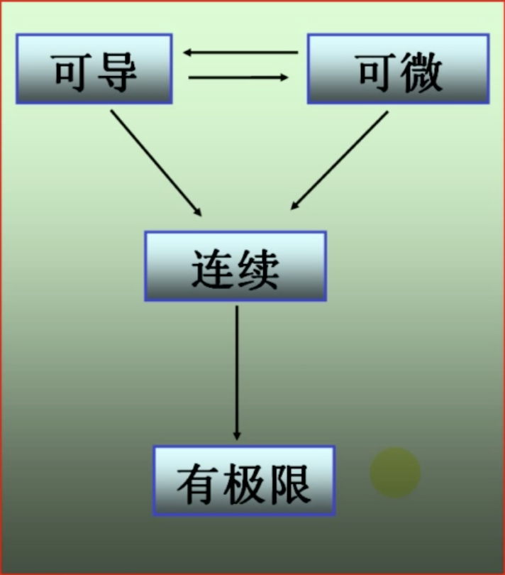
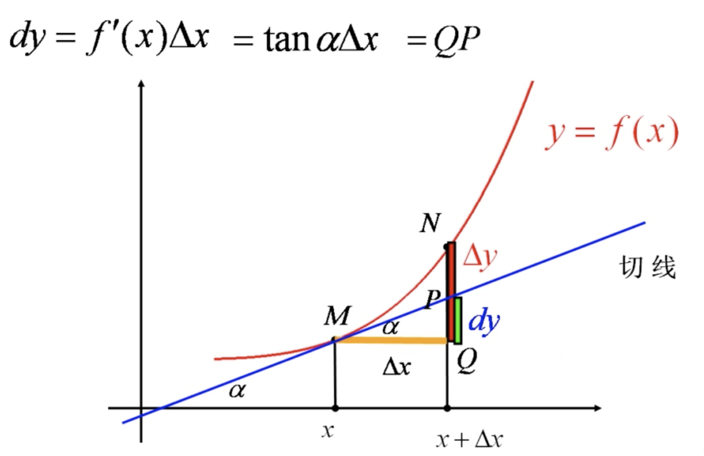

# 微分（differential）

## 一.定义

设在 一点 $x$ 处，$\Delta y=f(x+\Delta x)-f(x)$ ，

如果 $\Delta y = {\color{red} A\color{red} \Delta \color{red}x}+{\color{blue}o\color{blue}(\color{blue}\Delta \color{blue}x\color{blue})}$

其中 $A$ 是只与 $x$ 有关，而与 $\Delta x$ 无关的常数，${\color{blue}o\color{blue}(\color{blue}\Delta \color{blue}x\color{blue})}$ 是 $\Delta x$ 的高阶无穷小，则称函数 $f(x)$ 在点 $x$ 处可微（differentiable) 。

并将线性主部 ${\color{red}A\color{red}\Delta \color{red}x}$ 称为函数在点 $x$ 处对应于 $\Delta x$ 的微分（differential），记做 $dy$：
$$
\begin{align}
dy&={\color{red}A\color{red}\Delta \color{red}x}\\
\\

dy&=f'(x)dx\\
\end{align}
$$

### 1. 可微、可导、连续和有极限的关系

函数在一点可微 $\Leftrightarrow$ 函数在该点可导，且 $dy=f'(x)\Delta x$ ，即 $A=f'(x)$。

导数就是微分之商： 微商

### 2.几何意义

* 函数的局部线性化

  由于 $dy\approx \Delta y$，用局部用切线代替曲线，也称为函数的线性近似。

  线性近似公式：$f(x)\approx f(x_{0})+f'(x_{0})(x-x_{0})$

  特殊情况，$x_{0}=0$ 时：$f(x)\approx f(0)+f'(0)x$，$|x|$  趋于 0。

  > 
  >
  > 例如：
  >
  > $f(x)=sinx\,\, sinx\approx sin0 +cos0\cdot 0$
  >
  > $sinx\approx x$，$x$ 用弧度来表示

* $\Delta y$ 和 $dy$ 的比较

  

## 二.运算法则

每一个导数公式，都对应着一个微分公式：
$$
y'=f'(x)\Rightarrow dy=f'(x)dx
$$

### 1.基本初等函数的微分公式和运算法则

| 导数公式                    | 微分公式                      |
| --------------------------- | ----------------------------- |
| $(x^{\mu})'=\mu x^{\mu -1}$ | $d(x^{\mu})=\mu x^{\mu -1}\,dx$ |
|$(sinx)'= cosx$|$d(sinx)=cosx\,dx$|
|$(cosx)'=-sinx$|$d(cosx)=-sinx\,dx$|
|$(tanx)'=sec^{2}x$|$d(tanx)=sec^{2}x\,dx$|
|$(cotx)'=-csc^{2}x$|$d(cotx)=-csc^{2}x\,dx$|
|$(secx)'=secx\,tanx$|$d(secx)=secx\,tanx\,dx$|
|$(cscx)'=-cscx\,cotx$|$d(cscx)=-cscx\,cotx\,dx$|
|$(a^{x})'=a^{x}\ln a$|$d(a^{x})=a^{x}\ln a\,dx$|
|$(e^{x})'=e^{x}$|$d(e^{x})=e^{x}dx$|
|$(\log_{a}x)'=\frac{1}{x\ln a}$|$d(\log_{a}x)=\frac{1}{x\ln a}\,dx$|
|$(lnx)'=\frac{1}{x}$|$d(\ln x)=\frac{1}{x}\,dx$|
|$(arcsinx)'=\frac{1}{\sqrt{1-x^{2}}}$|$d(arcsinx)=\frac{1}{\sqrt{1-x^{2}}}\,dx$|
|$(arccosx)'=-\frac{1}{\sqrt{1-x^{2}}}$|$d(arccosx)=-\frac{1}{\sqrt{1-x^{2}}}\,dx$|
|$(arctanx)'=\frac{1}{1+x^{2}}$|$d(arctanx)=\frac{1}{1+x^{2}}\,dx$|
|$(arccotx)'=-\frac{1}{1+x^{2}}$|$d(arccotx)=-\frac{1}{1+x^{2}}\,dx$|

|      | 求导法则                                             | 微分法则                                             |
| ---- | ---------------------------------------------------- | ---------------------------------------------------- |
| 和   | $(u\pm v)'=u'\pm v'$                                 | $d(u\pm v)=du+dv$                                    |
| 差   | $(C\,u)'=C\cdot u'$                                  | $d(C\,u)=C\cdot du$                                  |
| 积   | $(uv)'=u'v+uv'$                                      | $d(uv)=vdu+udv$                                      |
| 商   | $(\frac{u}{v})'=\frac{u'v-uv'}{v^{2}}\,\,\,(v\neq0)$ | $d(\frac{u}{v})=\frac{vdu-udv}{v^{2}}\,\,\,(v\neq0)$ |

### 2. 复合函数微分法则

复核函数的微分：微分形式不变性

$$
\begin{align}
& y=f(u)\,\,\,\,u=g(x)\Rightarrow y=f[g(x)]\\
\\
& \frac{dy}{dx}=f'(u)u'\\
\\
&\because u'dx=du\\
\\
&\therefore dy=f'(u)u'=f'(u)du

\end{align}
$$
从我曾向内层逐层微分，直到 $dx$ 出现为止。

### 3.隐函数的微分

用微分法求隐函数的导数是一种好方法。

隐函数求微分时，我们不必考虑谁是自变量，谁是因变量（x，y 地位平等）。

而求导数时，我们必须将 $x$ 视为自变量，$y$ 视为因变量（x，y 地位不平等）。

> 例：
> $$
> \begin{align}
> x&=\ln y \\
> \\
> \textbf{微分}：\\
> dx&=d(\ln y)\\
> &=\frac{1}{y}dy\\
> \therefore dy&=y\cdot dx\\
> \\
> \textbf{求导}：\\
> (x)'&=(\ln y)'\\
> 1&=\frac{1}{y}\cdot y'\\
> \therefore y'&=y
> 
> \end{align}
> $$

### 4.凑微分

已知一个微分，求问是哪一个函数的微分，凑微分是不定积分的基本功。

## 三.微分中值定理与导数的应用

### (一).微分中值定理

#### 1.费马引理（Fermat Lemma）

设函数 $f(x)$ 在点 $x_{0}$ 的某个邻域内有定义，$f(x)$ 在 $x_{0}$ 处可导且在 $x_{0} $ 处取得极值，则必有 $f'(x_{0})=0$。

#### 2.罗尔定理（Rolle theorem）

设函数 $f(x)$ 满足以下三个条件：

(1) $f(x)$在闭区间 $[a,b]$ 上连续；

(2) $f(x)$ 在开区间 $(a,b)$ 内可导；

(3) 端值相等：$f(a)=f(b)$，

则存在 $\xi\in(a,b)$ ，使得 ${\color{red}f\color{red}'\color{red}(\color{red}\xi\color{red})\color{red}=\color{red}0}$。

罗尔定理中，缺少任何一个条件，导数的零点将可能不存在，以下是哪个函数在相应的区间内没有导数为零的点：

* 罗尔定理原型

  1691年，罗尔在研究多项式方程时发现:

  n 次方程 $a_{0}x^{n}+a_{1}x^{n-1}+...+a_{n-1}x+a_{n}=0$ 的每两个相邻的实根之间，一定有下列方程的实根：$a_{0}nx^{n-1}+a_{1}(n-1)x^{n-2}+...+a_{n-1}=0$

### (二). 洛必达法则

### (三).泰勒公式

### (四).函数的单调性与曲线的凹凸性

### (五).函数的极值与最大值最小值

### (六).函数的图形描绘

### (七).曲率

### (八).方程的近似解

## * 选学：

### (一).经济学中的常用函数

#### 1.需求函数

某商品的需求量是指在一定的价格水平上，在一定的时间内，消费者愿意而且有能力购买的商品量。

忽略其他次要因素，我们可以认为商品的需求量 $Q_{d}$ 是由商品价格 $P$ 决定的，因此需求量是价格的函数：
$$
Q_{d}=Q_{d}(P)
$$
称为需求函数（也叫需求价格函数）。

一般地，需求商品价格上涨会使需求量减少，因此需求函数一般是价格 $P$  的单调减函数。

* 价格函数

需求函数的反函数也称为需求函数。(需求决定价格，所以也称为价格函数)

* 饱和需求量

  当价格 P = 0 时，此时的需求量称为饱和需求量。

#### 2.供给函数

某商品的供给量是指在一定的价格水平上，在一定的时间内，生产者愿意生产并可提供出售的商品量。

忽略其他次要因素，我们可以认为水上漂的供给量 $Q_{s}$ 是由商品价格 $P$ 决定的，因此供给量是价格的函数：
$$
Q_{s} = Q_{s}(P)
$$
称为供给函数。

一般地，商品的价格上涨，生产者就更愿意生产并向时长提供更多的商品，

因此供给函数一般是几个 $P$ 的单调增函数。

* 均衡价格、均衡数量

  当供给量和需求量相等 $Q_{d}=Q_{s}$ 时，所得的 $P$ 称为商品的均衡价格，此时的供给量和需求量称为均衡数量。

  寻求君合价格是金融经济学的主要问题之一。

#### 3.总成本函数、总收益函数、总利润函数。

总成本是指生产一定数量的产品所需要的总投入。

 总收益是出售一定数量的产品所得到的全部收入。

总利润是总收益减去总成本后的余额。

若产品价格为 $P$，销售量为 $Q$

总成本、总收益和总利润都与产品的产量或销量 $Q$ 有关，因此它们都是 $Q$ 的函数。

总成本函数：$C=C(Q)$

总收益函数：$R=R(Q)=QP$(Q)

总利润函数：$L=L(Q)=R(Q)-C(Q)$

平均成本：$\bar{C}=\frac{C(Q)}{Q}$

平均收益：$\bar{R}=\frac{R(Q)}{Q}=P$

平均利润：$\bar{L}=\frac{L(Q)}{Q}$

通常，总成本由固定成本（不变成本） $C_{0}$ 与可变成本 $C_{1}$ 两部分构成。

固定成本是指支付固定生产要素的费用，如建厂房、购置设备等费用，它与产量 $Q$ 无关。

可变成本是指支付可变生产要素的费用，如购买原材料、燃料、支付工资等费用，它随产量 $Q$ 而变动。

于是有 $C(Q)=C_{0}+C_{1}(Q)$

总成本 $C(Q)$ 是产量 $Q$ 的单调增函数。

### (二).边际

一般地，设 $y=f(x)$ 是某一经济函数（如成本、收益、利润等等），且 $f(x)$ 可导，则成函数 $f'(x)$ 为 $f(x)$ 的边际函数。

$f'(x_{0})$ 表示：当 $x=x_{0}$ 时，$x$ 改变一个单位时，$y$ 会大约改变 $f'(x_{0})$ 个单位。（通常省去"大约"二字）

简而言之，边际函数就是导数。

函数的边际（导数，变化率）反映的是自变量改变 1 个单位时，因变量会改变几个单位（改变边际个单位）。

#### 1.边际成本（Marginal cost）

总成本函数 $C(Q)$ 对产量 $Q$ 的导数 $C'(Q)$称为 边际成本，记为 $MC$，即

$$
MC=C'(Q)=\frac{dC}{dQ}
$$

表示已经生产了 $Q$ 件产品，再多生产（或减少生产）一件产品的所增加（或减少）成本。

#### 2.边际收益（Marginal Revenue）

总收益函数 $R(Q)$ 对销量 $Q$ 的导数 $R'(Q)$ 称为边际收益，记为 $MR$ ，即
$$
MR=R'(Q)=\frac{dR}{dQ}=[QP(Q)]'=P(Q)+QP'(Q)
$$
它是总收益关于销量 $Q$ 的变化率，它（近似地）表示：假定已经销售了 $Q$ 件商品，再销售一件商品所增加的收益。

#### 3.边际利润（Marginal profit）

总利润函数 $L(Q)$ 对销量 $Q$ 的导数 $L'(Q)$ 称为边际利润，记为 $ML$ ，即
$$
ML = L'(Q)=\frac{dL}{dQ}
$$
它是总利润关于销量 $Q$ 的变化率，它（近似地）表示：假定已经销售了 $Q$ 件商品，再销售一件商品所增加的利润。

### (三).弹性（Elasticity）

#### 1.定义

如果说边际是函数的变化率，那么弹性则是函数的相对变化率。

设函数 $y=f(x)$ 在点 $x=x_{0}$ 处可导，函数的相对改变量 $\frac{\Delta y}{y_{0}}=\frac{f(x_{0}+\Delta x)-f(x_{0})}{y_{0}}\,\,\,\,(y_{0}=f(x_{0}))$ 与自变量的相对改变量 $\frac{\Delta x}{x_{0}}$ 之比 $\frac{\frac{\Delta y}{y_{0}}}{\frac{\Delta x}{x_{0}}}$ 称为函数 $f(x)$ 从 $x_{0}$ 到 $x_{0}+ \Delta x$ 两点间的平均相对变化率。也称为两点间的弹性。

当 $\Delta x\rightarrow0$ 时， $\frac{\frac{\Delta y}{y_{0}}}{\frac{\Delta x}{x_{0}}}$ 的极限称为函数 $y=f(x)$ 在点 $x=x_{0}$ 处的相对变化率或弹性（Elasticity），记作 $\frac{Ey}{Ex}|_{x=x_{0}}$ 或 $\frac{E}{Ex}f(x_{0})$
$$
\frac{Ey}{Ex}|_{x=x_{0}}=\lim_{\Delta x\rightarrow0}\frac{\frac{\Delta y}{y_{0}}}{\frac{\Delta x}{x_{0}}}=\lim_{\Delta x\rightarrow0}\frac{\Delta y}{\Delta x}\frac{x_{0}}{y_{0}}=f'(x_{0})\frac{x_{0}}{f(x_{0})}
$$

可导函数 $y=f(x)$ 在 $x$ 处的弹性
$$
\frac{Ey}{Ex}=y'\frac{x}{y}=\frac{dy}{dx}\frac{x}{y}
$$
称为 $y=f(x)$ 的弹性函数。

反映了随着 $x$ 的变化，$f(x)$ 的变化幅度的大小，他反应了 $f(x)$ 对 $x$ 的变化的反应的强烈程度或灵敏度。

具体的说， $\frac{E}{Ex}f(x_{0})$ 表示在点 $x=x_{0}$ 处，当自变量 $x$ 产生 1% 的改变时，函数 $y=f(x)$ 会（近似地）改变 $\frac{E}{Ex}f(x_{0})\%$。

* 边际与弹性
  $$
  \frac{Ey}{Ex}=\frac{dy}{dx}\frac{x}{y}=\frac{\frac{dy}{dx}}{\frac{y}{x}}=\frac{边际函数}{平均函数}
  $$
  所以弹性函数在经济学中可以理解为边际函数与平均函数的商。
  $$
  \frac{dy}{dx}=\frac{y}{x}\frac{Ey}{Ex}
  $$
  ​											边际=平均x弹性
  
* 不变弹性函数

  幂函数 $y=x^{\mu}$ 的弹性函数为 $\mu$ ，即任意点处弹性不变，称为不变弹性函数。

####  2.弹性的运算律

$$
\begin{align}
&(1)\frac{E}{Ex}[kf(x)]=\frac{Ef}{Ex}\\
\\
&(2)\frac{E}{Ex}[f(x)\pm g(x)]=\frac{f(x)\frac{Ef}{Ex}\pm g(x)\frac{Eg}{Ex}}{f(x)\pm g(x)}\\
\\
&(3)\frac{E}{Ex}[f(x)g(x)]=\frac{Ef}{Ex}+\frac{Ef}{Ex}\\
\\
&(4)\frac{E}{Ex}[\frac{f(x)}{g(x)}]=\frac{Ef}{Ex}-\frac{Eg}{Ex}\\
\\
&(5)\frac{E}{Ex}f[\varphi(x)]=\frac{Ef}{E\varphi}\cdot\frac{E\varphi}{Ex}\,\,\,\,(链式法则)
\end{align}
$$

由 (1) 可知，弹性没有线性性质：$\frac{E}{Ex}[kf(x)]\neq k\frac{E}{Ex}f(x)$

