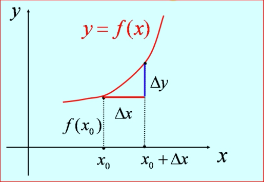
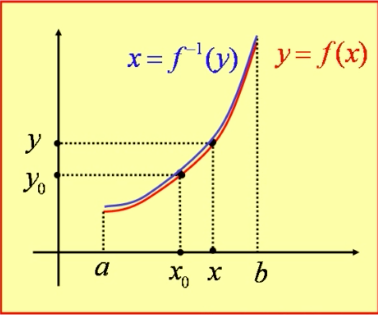
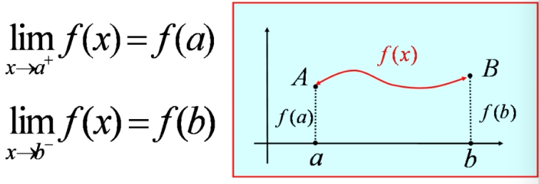

# 极限

##  一.证明

|| $ f(x)\rightarrow A $ |$f(x)\rightarrow \infty$|$f(x)\rightarrow  +\infty$|$f(x)\rightarrow -\infty$|
|----|----|----|----|----|
|$x \rightarrow x_{0}$|$\forall\varepsilon>0，\\\exist\delta>0，\\使当\,0<|x-x_{0}|<\delta\,时，\\即有\,|f(x)-A|<\varepsilon.$|$\forall M>0，\\\exist \delta>0，\\使当\,0<|x-x_{0}|<\delta，\\即有\,|f(x)|>M.$|$\forall M>0，\\\exist\delta>0，\\使当\,0<|x-x_{0}|<\delta\,时，\\即有\,f(x)>M.$|$\forall M>0，\\\exist \delta>0，\\使当\,0<|x-x_{0}|<\delta\,时，\\即有\,f(x)<-M.$|
|$x \rightarrow x_{0}^{+}$|$\forall\varepsilon>0，\\\exist\delta>0，\\使当\,x_{0}<x<x_{0}+\delta\,时，\\即有\,|f(x)-A|<\varepsilon.$|$\forall M>0，\\\exist\delta >0，\\使当\,x_{0}<x<x_{0}+\delta\,时，\\即有\,|f(x)|>M.$|$\forall M>0，\\\exist\delta>0，\\使当\,x_{0}<x<x+x_{0}\,时，\\即有\,f(x)>M.$|$\forall M>0，\\\exist\delta >0，\\使当\,x_{0}<x<x_{0}+\delta\,时，\\即有\,f(x)<-M.$|
|$x \rightarrow x_{0}^{-}$|$\forall\varepsilon>0，\\\exist\delta >0，\\使当\,x_{0}-\delta<x<x_{0}\,时，\\即有\,|f(x)-A|<\varepsilon.$|$\forall M>0，\\\exist\delta >0，\\使当\, x_{0}-\delta<x<x_{0}\,时，\\即有\,|f(x)|>M.$|$\forall M>0，\,\\\exist\,\delta > 0，\\使当\,x_{0}-\delta<x<x_{0}\,时，\\即有\,f(x)>M.$|$\forall M>0，\\\exist\delta>0，\\使当\,x_{0}-\delta<x<x_{0}\,时，\\即有\,f(x)<-M.$|
|$x \rightarrow \infty$|$\forall \varepsilon>0，\\\exist X>0，\\使当\,|x|>X\,时，\\即有\,|f(x)-A|<\varepsilon.$|$\forall M>0，\\\exist X>0，\\使当\,|x|>X\,时，\\即有\,|f(x)|>M\,.$|$\forall M>0，\\\exist X>0，\\使当\,|x|>X时，\\即有\,f(x)>M.$|$\forall M>0，\\\exist X>0，\\使当\,|x|>X\,时，\\即有\,f(x)<-M.$|
|$x \rightarrow +\infty$|$\forall\varepsilon>0，\\\exist X>0，\\使当\,x>X\,时，\\即有\,|f(x)-A|<\varepsilon.$|$\forall M>0，\\\exist X>0，\\使当\,x>X\,时，\\即有|f(x)|>M.$|$\forall M>0，\\\exist X>0，\\使当\,x>X\,时，\\即有\,f(x)>M.$|$\forall M>0，\\\exist X>0，\\使当\,x>X\,时，\\即有\,f(x)<-M.$|
|$x \rightarrow -\infty$|$\forall\varepsilon>0，\\\exist X>0，\\使当\,x<-X\,时，\\即有\,|f(x)-A|<\varepsilon.$|$\forall M>0，\\\exist X>0，\\使\,当x<-X\,时，\\即有\,|f(x)|>M.$|$\forall M>0，\\\exist X>0，\\使当\,x<-X\,时，\\即有\,f(x)>M.$|$\forall M>0，\\\exist X>0，\\使当\,x<-X\,时，\\即有\,f(x)<-M.$|

## 二.海涅定理（函数极限与数列极限的关系）

$\displaystyle\lim_{x\rightarrow x_{0}}f(x)=A\,$ 的充分比较条件是  $\displaystyle\forall\{x_{n}\}:\lim_{n\rightarrow\infty}f(x_{n})=A$

##  三.运算法则

### 1.基本法则

设 $\displaystyle\lim f(x)=A\,\,\,\,\,\lim g(x)=B$

则我们有以下运算法则：
$$
\begin{align}
\lim [f(x)\pm g(x)] &=\lim f(x) \pm \lim g(x) = A + B \\
\lim[f(x)\cdot g(x)]&=\lim f(x)\cdot\lim g(x)\\
\lim\frac{f(x)}{g(x)}&=\frac{\lim f(x)}{\lim g(x)}=\frac{A}{B}\,(B\neq 0)

\end{align}
$$
推论：
$$
\begin{align}
\lim(u_{1}+u_{2}+…+u_{n}) &=\lim u_{1}+\lim u_{2}+…+\lim u_{n}\\
\lim(u_{1}u_{2}…u_{n}) &=\lim u_{1}\cdot\lim u_{2}…\lim u_{n}\\
\lim[f(x)]^{n}&=[\lim f(x)]^{n}\\
\textbf{极限的线性性质（c 是常数）：}&\\
\lim(c_{1}u_{1}+c_{2}u_{}+...+c_{n}u_{n}) &=c_{1}\lim u_{1}+c_{2}\lim u_{2}+...+c_{n}\lim u_{n}\,\,

\end{align}
$$
**数列的极限也有类似的性质。**

### 2.  $\frac{0}{0}$ 型

**例 1.** 求 $\displaystyle\lim_{x\rightarrow2}\frac{x^{2}-x}{x_{2}-4}$ 的极限

解法：交换分子分母 $\displaystyle\lim_{x\rightarrow2}\frac{x^{2}-4}{x^{2}-x}=\frac{0}{2}=0$，得无穷小，再利用无穷小的倒数为无穷大得$\displaystyle\lim_{x\rightarrow2}\frac{x^{2}-x}{x^{2}-4}=\infty$   

**如果** $\lim f(x)=A\neq 0 \lim g(x)=0$ **，则 **$\lim\frac{f(x)}{g(x)}=\infty$ **无穷大。**

**例2. **设 $\displaystyle\lim_{x\rightarrow1}\frac{3x^{2}+xb+c}{x^{2}-1}=2$，求 b、c 的值。

解法：$\because\displaystyle\lim_{x\rightarrow1}(x^{2}-1)=0$ 分母趋于 0，且极限 $\displaystyle\lim_{x\rightarrow1}\frac{3x^{2}+xb+c}{x^{2}-1}$ 存在，所以必有 $\displaystyle\lim(3x^{2}+bx+c)=0$ ，带入 x = 1 可得 $3+b+c=0 \Rightarrow c=-3-b$

 $\displaystyle\lim_{x\rightarrow1}\frac{3x^{2}+bx+c}{x^{2}-1}=\lim_{x\rightarrow1}\frac{3x^{2}+bx-3-b}{x^{2}-1}\\=\displaystyle\lim_{x\rightarrow1}\frac{3(x^{2}-1)+b(x-1)}{x^{2}-1}=3+\lim_{x\rightarrow1}\frac{b}{x+1}\\=3+\frac{b}{2}=2\Rightarrow b=-2$ 

**如果 ** $\displaystyle\lim\frac{f(x)}{g(x)}$ **存在，且** $\lim g(x) = 0$ **，则必有** $\lim f(x)=0$。

### 3.  $\frac{\infty}{\infty}$ 型

$$
\displaystyle\lim_{x\rightarrow\infty}\frac{a_{0}x^{m}+a_{1}x^{m-1}+...+a_{m-1}x+a_{m}}{b_{0}x^{n}+b_{1}x^{n-1}+...+b_{n-1}x+b_n{}}\\
=\lim_{x\rightarrow\infty}\frac{a_{0}x^{m}}{b_{0}x^{n}}=\frac{a_{0}}{b_{0}}\lim_{x\rightarrow\infty}x^{m-n}=
\left\{\begin{matrix}
\frac{a_{0}}{b_{0}}\,\,&，if \,\,m=n\\
0\,\,&，if \,\,m<n\\
\infty\,\,&，if \,\,m>n\\
\end{matrix}\right.
$$

### 4. 夹逼准则（Squeeze Theorem）

* **数列**：

设有三个数列：$\{x_{n}\}\,\,\{y_{n}\}\,\,\{z_{n}\}$

若它们满足条件：
$$
\begin{align}
(1)\,\,& y_{n}\leq x_{n}\leq z_{n}\,\,\,(n=1,2,3,...)\\
(2)\,\,& \displaystyle\lim_{n\rightarrow\infty}y_{n}=A，\,\,\lim_{n\rightarrow\infty}z_{n}=A
\end{align}
$$
则   $\displaystyle\lim_{n\rightarrow\infty}x_{n}=A$

##### 

* **函数**：

设再 $x_{0}$ 的某个去心领域有：

$$
\begin{align}
(1)\,\,& g(x)\leq f(x)\leq h(x)\,\,\,(n=1,2,3,...)\\
(2)\,\,& \displaystyle\lim_{n\rightarrow\infty}g(x)=A，\,\,\lim_{n\rightarrow\infty}h(x)=A
\end{align}
$$
则   $\displaystyle\lim_{n\rightarrow\infty}f(x)=A$

### 5. 单调有界准则

* 数列：

  有界的单调数列一定收敛

* 函数：
设函数 $f(x)$ 在某个区间 $(x_{0}-\delta, x_{0})$ 上单调增加（单调减少），且有上界（下界），则 $f(x)$ 在 $x_{0}$ 的左极限存在：
  $$
  f(x_{0}^{-})=\lim_{x\rightarrow x_{0}^{-}}f(x)
  $$
  
  设函数 $f(x)$ 在某个区间 $(x_{0}, x_{0}+\delta)$ 上单调增加（单调减少），且有下界（上界），则 $f(x)$ 在 $x_{0}$ 的右极限存在：

$$
f(x_{0}^{+})=\lim_{x\rightarrow x_{0}^{+}}f(x)
$$

对 $x_{0}=\pm\infty$ 也成立，

设函数 $f(x)$ 在区间 $(a,+\infty)$ 上单调增加且有上界 M，则极限 $\displaystyle\lim_{x\rightarrow +\infty}f(x)$ 存在；若函数 $f(x)$ 在区间 $(-\infty, a)$ 上单调减少且有下界 -M，则极限 $\displaystyle\lim_{x\rightarrow -\infty}f(x)$ 存在。

## 四.常用极限

$$
\displaystyle\begin{align}
&\lim_{x\rightarrow0}\frac{sinx}{x} = 1 \,\,(重要极限一，三角函数)\\
&可得,\\
&\lim_{x\rightarrow 0}\frac{tanx}{x}=1\\
&\lim_{x\rightarrow0}\frac{arcsinx}{x}=1\\
&\lim_{x\rightarrow0}\frac{arctanx}{x}=1\\
&\lim_{x\rightarrow\infty}\frac{sinx}{x} = 0 \,\,(注意，这个不是重要极限)\\
\\
\\
&\lim_{x\rightarrow\infty}(1+\frac{1}{x})^{x}=e\,(x>0||x<-1)\,\,(重要极限二，幂指函数)\\
&可得,\\
&\lim_{x\rightarrow\infty}(1+\frac{k}{x})^{x}=e^{k}\,(k\neq 0)\\
&\lim_{x\rightarrow\infty}(1+\frac{k}{x})^{lx}=e^{kl}\\
&\lim_{x\rightarrow\infty}(1+\frac{k}{x})^{l+x}=e^{k}\\
&\lim_{x\rightarrow\infty}(\frac{x+a}{x+b})^{x}=e^{a-b}\\
\\
\\
&\lim_{n\rightarrow\infty}\sqrt[n]{n}=1\\
&\lim_{n\rightarrow\infty}\sqrt[n]{a}=1\,\,（a>0）\\
&\lim_{n\rightarrow\infty}\frac{n}{a^{n}}=0\,\,（a>1）\\
\\
&\lim_{n\rightarrow\infty}cosx =1\\
\end{align}
$$

* 幂指函数的极限：

  若 $\lim u(x) = a>0，\,\,\,\lim v(x) = b$ ，则 $ \lim u(x)^{v(x)} = a^{b}$，
  
  若 $\lim u(x)=1，\,\,\,\lim v(x)= \infty$，则 $\lim u(x)^{v(x)} \overset{1^{\infty}}{====}e^{\lim v(x)(u(x)-1)}$

## 五.无穷小

### 1.定义

设 $\lim\alpha=0$   $\lim\beta=0$

（1）$\lim\frac{\beta}{\alpha}=0 \Rightarrow \beta$ 是比 $\alpha$  高阶的无穷小 ，记 $\beta=o(\alpha)$。

（2）$\lim\frac{\beta}{\alpha}=c\,(c\neq0) \Rightarrow \beta$ 与 $\alpha$ 是 同阶的无穷小 ，记 $\beta=O(\alpha)$。

（3）$\lim\frac{\beta}{\alpha}=1\Rightarrow \beta$ 与 $\alpha$ 是 等价的无穷小 ，记 $\beta \sim \alpha$。

（4）$\displaystyle\lim_{x\rightarrow0}\frac{\alpha}{x^{k}}=c\neq0\,(k>0)\Rightarrow\alpha$ 是 x 的  k 阶无穷小。

> 1.低阶无穷小+高阶无穷小=低阶无穷小
>
> 即 $\alpha + o(\alpha) = \alpha$
>
> 2.等价无穷小的差是比它们更高阶的无穷小
>
> 即 $\beta=O(\alpha)$，$\alpha-\beta=o(\alpha)$

### 2.等价无穷小

* **x → 0 ：**

$$
\displaystyle\begin{align}
(1+x)^{\mu}-1 &\sim\mu x \\\\\
\sqrt[n]{1+x}-1 &\sim \frac{x}{n}\\\\
\sqrt{1+x}-1 &\sim\frac{x}{2}\\\\
\\
 arcsinx\sim sinx\sim arctanx\sim tanx &\sim x \\\\
 1-cosx &\sim \frac{x^{2}}{2}\\\\
 \\
 \ln(1+x) &\sim x\\
 a^{x}-1 &\sim x\ln a\\
 e^{x}-1 &\sim x\\
 
 \\
 \\ 

 x-sinx \sim \frac{x^{3}}{6}，\,\, & \,\, arcsinx-x\sim\frac{x^{3}}{6}\\\\
 tanx-x \sim \frac{x^{3}}{3}，\,\, & \,\,x-arctanx\sim\frac{x^{3}}{3}\\\\
 tanx-sinx \sim \frac{x^{3}}{2}，\,\, & \,\, x-\ln(1+x)\sim\frac{x^{2}}{2}\\\\
 e^{\alpha}-e^{\beta}&\sim e^{\alpha-\beta}\\
\end{align}
$$

#### 2.1 无穷小的等价替换定理

设  $\lim\alpha=0$  $\lim\beta=0$  $\alpha\sim\beta$

则 $\lim f(x)\alpha=\lim f(x)\beta$

注意：只有乘积因子才能等价替换，加减项之间一般不能进行等价替换

## 六.函数的连续性

### 1.定义

函数的连续性：

当 $\Delta x\rightarrow 0$ 时，$\Delta y\rightarrow 0$ 

函数 $f(x)$ 在点 $x_{0}$ 处连续 $\Leftrightarrow \displaystyle\lim_{\Delta x\rightarrow0}\Delta y=0$ （增量极限形式）

​                                            $\displaystyle\Leftrightarrow \lim_{x\rightarrow0}[f(x)-f(x_{0})]=0$

​                                            $\displaystyle\Leftrightarrow \lim_{x\rightarrow0}f(x)=f(x_{0})$ （函数极限形式）

* 函数的连续性的 $\varepsilon -\delta$ 定义：
  $$
  \begin{align}
  &\forall\varepsilon >0,\exist\delta>0\\
  &\forall x:|x-x_{0}|<\delta\Rightarrow|f(x)-f(x_{0})|<\varepsilon
  \end{align}
  $$
  

> 若函数 $f(x)$ 在点 $x_{0}$ 处连续，则称 $x_{0}$ 为函数的连续点。
>
> 连续点 $\displaystyle x_{0}：\lim_{x\rightarrow x_{0}}f(x)=f(x_{0})$ 
>
> 若函数 $f(x)$ 在点 $x_{0}$ 处不连续，则称 $x_{0}$ 为函数的间断点。
>
> 间断点 $\displaystyle x_{0}：\lim_{x\rightarrow x_{0}}f(x)\neq f(x_{0})$ 
>
> 单侧连续：
>
> 左连续: $\displaystyle\lim_{x\rightarrow x_{0}^{-}}f(x)=f(x_{0})=f(x_{0}^{-})$
>
> 右连续: $\displaystyle\lim_{x\rightarrow x_{0}^{+}}f(x)=f(x_{0})=f(x_{0}^{+})$

### 2.间断点

* 无穷间断点（Infinity discontinunity）：函数在 $x_{0}$ 处无定义，且极限为 $\infty$ 。

  例如：$f(x)=tanx$ ，在  $x_{0}=\frac{\pi}{2}$ 处无定义，

  但 $\displaystyle\lim_{x\rightarrow x_{0}}tanx=\infty$ 。

  

* 振荡间断点（Oscillating discontinunity）: 函数在 $x_{0}$ 处无定义，且在靠近 $x_{0}$ 时不断振荡。

  例如：$f(x)=sin\frac{1}{x}$ ，在 $x_{x}=0$  处无定义，

  且 $\displaystyle\lim_{x\rightarrow x_{0}} sin\frac{1}{x}$  不存在，

  但在趋于 $x=x_{0}$ 时，不断振荡。

  

* 可去间断点（Removable discontinity）：函数在 $x_{0}$ 处无定义但有极限（左右极限存且相等），称为可去间断点。

  例如： $f(x)=\frac{x^{2}-1}{x-1}$ ，在 $x_{0}=1$ 处无定义，

  但  $\displaystyle\lim_{x\rightarrow1}\frac{x^{2}-1}{x-1}=\lim_{x\rightarrow 1}\frac{(x-1)(x+1)}{x-1}=\lim_{x\rightarrow 1}(x+1) = 2$ 。

  

* 跳跃间断点（Jump discontinunity）: 函数在 $x_{0}$ 处左右极限存在，但不相等。

  例如：$f(x)=
  \left\{\begin{matrix} 
  &x-1，x<0\\ 
  &0，x=0\\ 
  &x+1，x>0\\
  \end{matrix}\right.$ 在 $x=0$ 处左右极限不相等。

> 第一类间断点：左右极限都存在的间断点 → 可去间断点、跳跃间断点。
>
> 第二类间断点：左右极限至少有一个不存在的间断点 → 无穷间断点、振荡间断点、其他点断点（如 Dirichlet 函数的间断点）

## 七.连续函数的运算

 ### 1.定理

定理 设函数 $f(x)$ 和 $g(x)$ 在点 $x_{0}$ 处连续，则

$$
\begin{align}
f(x)\pm g(x)\,\,\,\,\,\,\,\,\,f(x)g(x)\,\,\,\,\,\,\,\,\,&\frac{f(x)}{g(x)} \\
&(g(x_{0}\neq0))
\end{align}
$$
也在 $x_{0}$ 处连续。

### 2.反函数和复合函数的连续性

#### 2.1  反函数的连续性

定理  设 $y=f(x)$ 在区间 $I=(a,b)$ 上单调且连续，则其反函数 $x=f^{-1}(y)$ 在区间 $J=f(I)$ 上单调且连续。

### 2.2 复合函数的连续性

* 复合函数的极限定义：

设 $y=f[g(x)]$ 是由函数 $y=f(u)$ 与 $u=g(x)$ 复合而成的复合函数。

若 $\lim_{x\rightarrow x_{0}}g(x)=u_{0}({\color{blue}{g(x)\neq u_{0}}})\,\,\,\,\lim_{u\rightarrow u_{0}}f(u)=A$

则 $\displaystyle\lim_{x\rightarrow x_{0}}f[g(x)]=A=\lim_{u\rightarrow u_{0}}f(u)$

稍加修改，得极限的另一个定理：

若 $\displaystyle\lim_{x\rightarrow x_{0}}g(x)=u_{0}\,\,\,\,\,\,\,\lim_{u\rightarrow u_{0}}f(u)=f(u_{0})$

则 $\lim_{x\rightarrow x_{0}}f[g(x)] = f(u_{0})\,\,\,\,\,{\color{#4841c0}{f(u)在u_{0}处连续}}$

> $\displaystyle\lim_{x\rightarrow x_{0}}f[g(x)]=f[\lim_{x\rightarrow x_{0}}g(x)]$
>
> 极限可以穿过连续函数取到内函数上面

* 复核函数的连续性定理：

设函数 $u=g(x)$ 在点 $x_{0}$ 处连续，

$y=f(u)$ 在点 $u_{0}=g(x_{0})$ 处连续，

则复核函数 $y=f[g(x)]$ 在点 $x_{0}$ 处连续。

> 推论：连续函数的复核函数任为连续函数。

### 3.初等函数的连续性

指数函数连续 $\Leftrightarrow$ 对数函数连续（互为反函数）

幂函数连续

三角函数连续 $\Leftrightarrow$ 反三角函数连续（互为韩寒苏）

多项式函数、有理分式函数连续

即：一切初等函数在其定义区间内都是连续的。

> 定义区间：定义域内的区间。
>
> 注：有的初等函数的定义域不能构成区间，连续性无从谈起。
>
> 如：$y=\sqrt{sinx-1} $ 的定义域都是孤立的点，不能构成区间。

### 4.闭区间上连续函数的性质

函数 $f(x)$ 在闭区间 [a,b] 上连续是只 $f(x)$ 在该区间内的每一个点都连续，并且在两个端点单侧连续。

#### 4.1 有界性定理

在闭区间 [a, b] 上的连续函数 $f(x)$ 在该区间上是有界的。

> 注意：在开区间上连续的函数不一定能够取到最大(最小)的函数值，也不一定有界。

